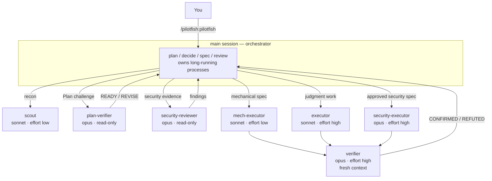

# pilotfish 🐟

> Pilot fish swim alongside the ocean's largest predators — small, fast, and doing the routine work so the big one doesn't have to.

**pilotfish** is a multi-model orchestration plugin for [Claude Code](https://code.claude.com). The frontier model (Claude Fable 5 / Opus) plans and decides in your main session; seven pinned role agents split bounded discovery, Plan review, execution, security review, and outcome verification. Quality is protected by phase gates and fresh-context verification, not by using the biggest model everywhere. It ships as pure markdown and JSON — no hook, no interpreter, no runtime dependency of any kind — so it runs anywhere Claude Code runs, Windows included.

```
/plugin marketplace add Nanako0129/pilotfish
/plugin install pilotfish@pilotfish
```

Then type `/pilotfish:pilotfish` to arm it for the session, or `/pilotfish:pilotfish <task>` to arm it and start. Plugin skills are namespaced; bare `/pilotfish` is not the installed command. It never activates on its own. Nothing is written into your `~/.claude/` config or into your projects; uninstalling (`/plugin uninstall pilotfish`) removes every trace.

> **Runtime requirement:** Claude Code **2.1.207 or newer**. This is the verified baseline that enforces agent `tools` allowlists. The plugin manifest has no minimum-runtime field, so the skill checks `claude --version` when invoked and stops before delegation or writes on an older or unidentifiable build; do not bypass that gate.

One manual step, if you want it: no plugin can set your main-session model, so put the orchestrator on the frontier tier yourself with `/model best` — or persist `{ "model": "best", "fallbackModel": ["opus", "sonnet"] }` in `~/.claude/settings.json`. pilotfish works without it, but the cost argument below assumes a frontier orchestrator.

[繁體中文說明](./README.zh-TW.md)

## Why

**Cost.** Most tokens in a coding session are not judgment — they're searching, mechanical edits, test runs, and doc updates that a cheaper model does just as well. Meanwhile Fable 5 consumes subscription limits ~2× faster than Opus, and agentic sessions with heavy tool use burn far steeper than that in practice.

The split is officially benchmarked, and pilotfish ships exactly the configuration Anthropic measured: a **Fable 5 orchestrator with Sonnet 5 workers reaches 96% of all-Fable performance for 46% of the cost** (BrowseComp: 86.8% vs 90.8% accuracy, $18.53 vs $40.56 per problem — [multi-agent docs](https://platform.claude.com/docs/en/managed-agents/multi-agent)). A community 12-worker audit puts the same split at [58% cheaper](https://www.developersdigest.tech/blog/fable-5-orchestrator-model-playbook) in API dollars ($14.50 → $6.10).

> On subscriptions it's better than the per-token price suggests: the weekly limit is [two buckets](https://support.claude.com/en/articles/14552983-models-usage-and-limits-in-claude-code) — a shared "all models" bucket **plus an additional Sonnet-only bucket**. Routing execution to Sonnet costs less per token *and* draws on headroom the frontier model can't touch.

**Speed.** Sonnet returns tokens faster than Opus, and the two highest-volume roles run at `effort: low`, which removes most of the thinking latency from work that doesn't need it. Independent delegations are spawned in the background and overlap, so wall-clock tracks the slowest agent rather than the sum of them.

The quality you'd expect to lose is bought back at two boundaries: a read-only `plan-verifier` challenges material Plans before approval, and an independent outcome `verifier` tries to *refute* finished work. That's not a hedge: Anthropic's [Fable 5 prompting guide](https://platform.claude.com/docs/en/build-with-claude/prompt-engineering/prompting-claude-fable-5) is explicit that fresh-context verifier subagents outperform self-critique. Verification is reserved for material Plans and non-trivial outcomes rather than added to every small task.

## How it works

Two layers, one install: **roles** (`agents/*.md`, each pinning its own model in one line of frontmatter) and **policy** (`skills/pilotfish/SKILL.md`, written in terms of roles and never model names, loaded by `/pilotfish:pilotfish`). Positive tool allowlists enforce the three read-only roles; two cross-cutting prohibitions remain policy-only — see [Why no guard](#why-no-guard) for that trade-off.



| Role | Model | Effort | Used for |
|---|---|---|---|
| `scout` | sonnet | low | Read-only recon: "where/how is X", symbol usages, config values |
| `plan-verifier` | opus | medium | Tool-enforced read-only Plan challenge before approval; returns READY/REVISE |
| `security-reviewer` | opus | high | Tool-enforced read-only security evidence and threat review before approval |
| `mech-executor` | sonnet | low | Fully-specified mechanical work: pattern refactors, convention tests, docs, bulk edits |
| `executor` | sonnet | high | Implementation needing judgment: features, bug fixes, design-sensitive refactors |
| `verifier` | opus | high | Fresh-context adversarial verification; returns CONFIRMED/REFUTED, never fixes |
| `security-executor` | opus | high | Approved security-sensitive implementation — deliberately kept off Fable 5, whose safety classifiers can refuse benign defensive-security work |

`scout`, `mech-executor`, and `executor` are all Sonnet and differ only in effort — which is precisely why they're three files. The `Agent` tool has no `effort` parameter, so frontmatter is the *only* place effort can be set: one role definition means one effort level, and a 30-file rename would run at `high` for nothing.

The policy adds a phase-aware lifecycle: bounded read-only Discovery, main-session Plan synthesis, explicit approval before gated writes, stable execution contracts, and fresh outcome verification. It keeps small stable work direct, prevents a single unknown bug from becoming a sequential scout-to-executor relay, and separates pre-approval security evidence from write-capable security execution.

## Why no guard

pilotfish has two rules a subagent might otherwise ignore, and it would be natural to enforce them with a `PreToolUse` hook that removes the capability outright instead of asking the model not to use it. A locked door beats a "please don't enter" sign: the model never gets to weigh the rule against the task in front of it. pilotfish deliberately doesn't. It's worth being honest about why, and what it costs you.

A hook is a script, and a script needs an interpreter — one Claude Code does not guarantee. Per its own docs, nothing is guaranteed present on a machine running it: not Python, and not even `node`, since the native standalone installer doesn't put `node` on `PATH` at all. Native Windows is the sharp edge — it honors neither a `#!` shebang nor the Unix executable bit, so the usual "ship a script, mark it executable" hook is Unix-only by construction and cannot so much as launch there. A plugin that ships an interpreted hook therefore does not run everywhere Claude Code runs, and pilotfish's whole premise is that it should: a zero-dependency install that's just markdown and JSON. Worse, a hook like this fails *open* — so on the machines where the interpreter is missing you'd get no enforcement and no warning, which is the bad case, because you'd stop watching for what you believe is being caught. A door that isn't there is better than a door you wrongly believe is locked. So enforcement stays at the policy layer: rules stated plainly in [`skills/pilotfish/SKILL.md`](./skills/pilotfish/SKILL.md), which a subagent can read and, in principle, ignore. Universal portability is the trade. These are the rules the prompt carries alone:

- **Never invoke the built-in `Explore` agent.** Since Claude Code v2.1.198 it inherits your main-session model, so every search it runs from a Fable/Opus session bills at frontier rates — exactly the cost this plugin exists to avoid. A plugin can't shadow a built-in (plugin agents are namespaced), so this can't be fixed by routing around it either: use `pilotfish:scout`, the same read-only recon role pinned to Sonnet at low effort, every time.
- **Subagents must not detach a process** (`run_in_background`, `nohup`, `setsid`, `disown`, a trailing `&`). When a subagent's foreground command exceeds its `timeout`, Claude Code doesn't kill it — it promotes it to a background task. If the agent was spawned in the background that promoted process survives and its output is collected; if it was spawned in the *foreground* it is `SIGTERM`ed seconds after the agent returns, destroying the work. Detaching dodges that `SIGTERM` only by escaping Claude Code's task tracking entirely — no task id, no captured output, no notification — which launders a destroyed result into an orphaned one. Long-running processes belong to the orchestrator, the one context whose background tasks are both tracked and reliably notified.

Both rules are established by experiment, not assumed, and both live as instructions in the skill prompt an orchestrating session loads — read [`skills/pilotfish/SKILL.md`](./skills/pilotfish/SKILL.md) for the exact wording. Nothing removes the capability: a subagent that ignores the instruction will not be stopped. That is the honest state of it.

## More

[**docs/design.md**](./docs/design.md) — why role-based policy, why model aliases over pinned IDs, effort tiering, the fallback story when a tier disappears, tuning knobs, and what was deliberately left out.
[**docs/research.md**](./docs/research.md) — the underlying research: Fable 5's strengths and when it's wasteful, subscription economics, official Claude Code mechanisms, community measurements, with sources ([繁體中文](./docs/research.zh-TW.md)).

**Want OpenAI GPT-5.6 inside Claude Code without changing native Claude state?** [Remora](https://github.com/Nanako0129/remora-cc) packages pilotfish's role-based orchestration pattern into a session-scoped launcher for an existing Anthropic-compatible gateway: its model and gateway overrides disappear with the child process.

**Prior art & credits.** The "smart brain, cheap hands" split is not pilotfish's invention: Anthropic's own engineering writeup ([Decoupling the brain from the hands](https://www.anthropic.com/engineering/managed-agents)) frames it, Claude Code ships [`opusplan`](https://code.claude.com/docs/en/model-config) built in — if all you want is a cheaper session, `/model opusplan` needs no plugin at all — and [Rylaa/fable5-orchestrator](https://github.com/Rylaa/fable5-orchestrator) explored the plugin-with-guard-hooks shape, which pilotfish deliberately does not follow — see [Why no guard](#why-no-guard). pilotfish's contribution is small: seven deliberately-few roles instead of a large catalog, a policy that survives model churn because it never names a model, and rules that were each established by experiment rather than reasoning — including one that overturned this project's own previous advice.

## License

[MIT](./LICENSE)
