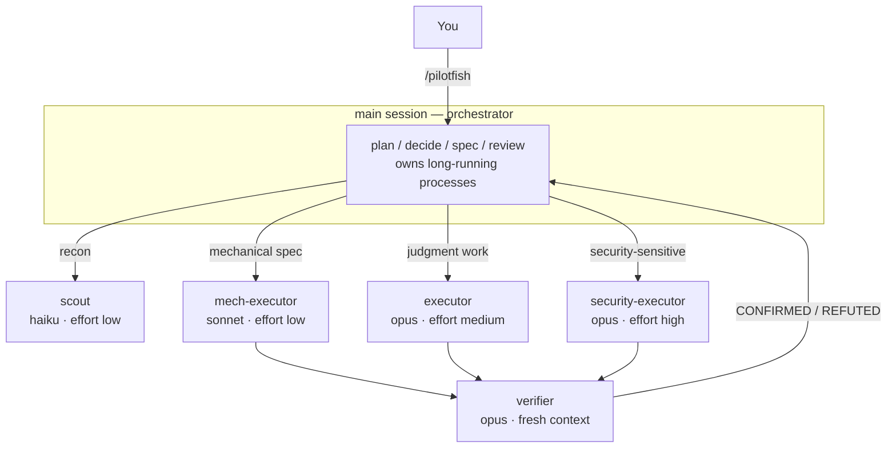

# pilotfish 🐟

> Pilot fish swim alongside the ocean's largest predators — small, fast, and doing the routine work so the big one doesn't have to.

**pilotfish** is a multi-model orchestration plugin for [Claude Code](https://code.claude.com): the frontier model (Claude Fable 5 / Opus) plans, decides, and reviews in your main session, while cheaper models (Opus / Sonnet / Haiku) execute the volume work through role agents. Quality is protected by fresh-context verification, not by using the biggest model everywhere.

```
/plugin marketplace add Nanako0129/pilotfish
/plugin install pilotfish@pilotfish
```

Then type `/pilotfish`, and the rest of your session runs this way. Nothing is written into your `~/.claude/` config or into your projects; uninstalling removes every trace. ([Full install notes](#install).)

The rules that matter aren't asked for — they're **enforced by a hook**. See [The guard](#the-guard).

> **Want OpenAI GPT-5.6 inside Claude Code without changing native Claude state?** [Remora](https://github.com/Nanako0129/remora-cc) packages pilotfish's role-based orchestration pattern into a session-scoped launcher for an existing Anthropic-compatible gateway. Use pilotfish for the native Claude Code path; use Remora for an approval-gated, verifiable install whose model and gateway overrides disappear with the child process.

[繁體中文說明](./README.zh-TW.md)

## Contents

- [Why](#why)
- [How it works](#how-it-works)
- [The guard](#the-guard)
- [Install](#install)
- [Using it](#using-it)
- [Trust & security](#trust--security)
- [The fallback story](#the-fallback-story)
- [Tuning & FAQ](#tuning--faq)
- [Research & design](#research--design)
- [Uninstall](#uninstall)
- [License](#license)

## Why

Frontier-model sessions are expensive in exactly the place it hurts subscribers: Claude Fable 5 consumes subscription limits **~2× faster than Opus** (official UI wording), and agentic sessions with heavy tool use burn far steeper than that in practice. Meanwhile, most tokens in a coding session are *not* judgment — they're searching, mechanical edits, test runs, and doc updates that a cheaper model does just as well.

Every piece of this carries Anthropic backing. The [Fable 5 prompting guide](https://platform.claude.com/docs/en/build-with-claude/prompt-engineering/prompting-claude-fable-5) recommends frequent subagent delegation and notes that **independent fresh-context verifier subagents outperform self-critique**. And as of 2026-07-08 the cheap-executor split is officially benchmarked: Anthropic's own tests put a **Fable 5 orchestrator with Sonnet 5 workers at 96% of all-Fable performance for 46% of the cost** (BrowseComp: 86.8% vs 90.8% accuracy, $18.53 vs $40.56 per problem) ([multi-agent docs](https://platform.claude.com/docs/en/managed-agents/multi-agent)). A community experiment points the same direction at hobby scale — a delegation-heavy 12-worker audit ([Developers Digest](https://www.developersdigest.tech/blog/fable-5-orchestrator-model-playbook)), best-case-shaped, in API dollars:

| Setup (12-worker audit experiment, Developers Digest) | Cost | Savings |
|---|---|---|
| Everything on Fable 5 | $14.50 | — |
| Fable 5 orchestrates + Sonnet workers | $6.10 | 58% |
| Fable 5 orchestrates + Haiku workers | $3.70 | 74% |

> **Tip:** Claude subscriptions use a two-bucket weekly limit ([official article](https://support.claude.com/en/articles/14552983-models-usage-and-limits-in-claude-code)) — a shared "all models" bucket plus an **additional Sonnet-only bucket**. Routing execution to Sonnet agents costs less per token *and* draws on that extra dedicated headroom.

> **Note:** These are subscription-plan mechanics. On the pay-per-token API the per-token savings still apply (there is no weekly bucket). On Bedrock / Vertex / Foundry, aliases resolve to each platform's built-in defaults and Fable 5 may not be enabled.

## How it works

Three layers, one install:

| Layer | Where | Job |
|---|---|---|
| Roles | `agents/*.md` | Five role agents, each pinned to the right model tier via one line of frontmatter |
| Policy | `skills/pilotfish/SKILL.md` | *How* to delegate — written in terms of roles, never model names. Loads when you type `/pilotfish` |
| **Guard** | `hooks/` + `scripts/guard.py` | Enforces the rules a policy can only ask for |



The five roles:

| Role | Model | Effort | Used for |
|---|---|---|---|
| `scout` | haiku | low | Read-only recon: "where/how is X", symbol usages, config values |
| `mech-executor` | sonnet | low | Fully-specified mechanical work: pattern refactors, convention tests, docs, bulk edits |
| `executor` | opus | medium | Implementation needing judgment: features, bug fixes, design-sensitive refactors |
| `verifier` | opus | medium | Fresh-context adversarial verification; returns CONFIRMED/REFUTED, never fixes |
| `security-executor` | opus | high | Anything security-sensitive — deliberately kept off Fable 5, whose safety classifiers can refuse benign defensive-security work |

The policy adds the operating rules: spec delegations in one shot (including the *why*), start with the cheapest plausible role and escalate after two failures, let each role take its model only from its own definition, schedule independent work in the background, and gate non-trivial work behind a `verifier` pass before calling it done.

## The guard

A policy is a request. A missing capability is a fact. Three rules that used to be prose are now enforced by a `PreToolUse` hook, because prose kept failing:

| | Main session | Subagent |
|---|---|---|
| `run_in_background` | allowed | **denied** |
| `nohup` / `setsid` / trailing `&` | allowed | **denied** |
| built-in `Explore` agent | **denied** → use `scout` | — |

**Why subagents may not detach.** When a subagent's foreground command exceeds its `timeout`, Claude Code does not kill it — it promotes it to a background task and reports *"you will be notified when it completes."* Whether that promise holds depends on how the orchestrator spawned the agent:

- Spawned with **`run_in_background: true`** → the promoted process survives, runs to completion, its output is captured, and the notification re-invokes the agent. **Safe.**
- Spawned in the **foreground** → the promoted process is `SIGTERM`ed a few seconds after the agent returns. **The work is destroyed and its captured output truncated mid-stream.**

`nohup` and `setsid` dodge that `SIGTERM` by escaping the process group — which is exactly why the pattern gets adopted — but they also escape Claude Code's task tracking: no task id, no captured output, no completion notification. The result is an orphan nobody ever collects. Detaching doesn't rescue the handoff; it launders a destroyed result into a lost one.

So subagents don't get to detach at all. They run commands in the foreground with an explicit `timeout`, and hand back anything that can't finish inside one. **Long-running processes belong to the orchestrator** — the main session is the only context whose background tasks are both tracked and reliably notified.

This is also why the policy insists on spawning agents with `run_in_background: true`. That isn't only cheaper and more parallel: it's the difference between an agent's long command finishing and being killed.

**Why the built-in `Explore` is blocked.** Since Claude Code v2.1.198 the built-in `Explore` agent inherits your main-session model, so every background search from a Fable/Opus session bills at frontier rates. A plugin cannot shadow a built-in agent (plugin agents are namespaced), so pilotfish blocks it and routes recon to `scout`, which is pinned to Haiku.

Every one of these behaviours was established by experiment, not assumed. The guard fails open: a malformed payload never breaks your session.

## Install

```
/plugin marketplace add Nanako0129/pilotfish
/plugin install pilotfish@pilotfish
```

Then restart Claude Code, or run `/reload-plugins` to pick it up in the current session.

That's the whole install. Nothing is written into your `~/.claude/` config and nothing is written into your projects — the plugin is self-contained, and uninstalling it removes every trace.

**One manual step, if you want it.** The plugin cannot set your main-session model (no plugin can). To run the orchestrator on the best available frontier model, set it yourself:

```
/model best
```

Or persist it in `~/.claude/settings.json`:

```json
{ "model": "best", "fallbackModel": ["opus", "sonnet"] }
```

pilotfish works without this — the role agents are pinned regardless — you just won't get the frontier orchestrator the cost argument assumes.

**Updating** is automatic: bump-versioned releases arrive through the marketplace. `/plugin` → Marketplaces to control it.

## Using it

```
/pilotfish
```

Arms pilotfish for the rest of the session. Everything you ask from then on gets orchestrated — recon to `scout`, mechanical work to `mech-executor`, judgment to `executor`, and a `verifier` pass before anything is called done.

```
/pilotfish sort out gh issue 42
```

Same thing, and it starts on the task immediately.

Both are explicit — pilotfish never activates on its own.

## Trust & security

pilotfish installs a plugin containing five agent definitions, one skill, and one hook script. The hook (`scripts/guard.py`) runs on every `Bash` and `Agent` tool call, so read it before you install — it is ~100 lines and does exactly one thing: deny a small set of calls, and allow everything else. It never inspects your code, never phones home, and has no network access.

- **Read the bytes that run:** [`scripts/guard.py`](./scripts/guard.py), the five files in [`agents/`](./agents/), and [`skills/pilotfish/SKILL.md`](./skills/pilotfish/SKILL.md). That's everything.
- **Pin it:** the marketplace entry is versioned; installing pins you to a release, and you only move when you choose to.
- **The guard fails open.** If it can't parse a payload it allows the call. It cannot lock you out of your own session.

## The fallback story

The whole stack keeps working when the frontier model disappears, because no policy text ever names a model:

| Failure mode | What catches it | Your action |
|---|---|---|
| Fable 5 leaves your plan | `best` re-resolves to the latest Opus | Likely none. Never pin `fable`/full IDs: pinned IDs hard-errored in June 2026 |
| Model overloaded / API errors | `fallbackModel: ["opus", "sonnet"]` switches automatically | None |
| A tier gets deprecated (Opus 4.8 → 4.9) | Role agents use aliases (`opus`, `sonnet`, `haiku`) that track the recommended version | None |
| Frontier refuses a security task mid-run | Security work is pre-routed to `security-executor` (Opus), so it never reaches the classifier | None |

The policy speaks only of roles. Model bindings live in exactly one place — one line of frontmatter per agent file — so re-pointing a tier is a one-line edit that takes effect everywhere.

## Tuning & FAQ

| Question | Answer |
|---|---|
| I want to save even more quota | Switch the main session to `/model opusplan` — Opus thinks in plan mode, Sonnet executes. The role agents keep working unchanged underneath. |
| Can I force every subagent onto one model? | `CLAUDE_CODE_SUBAGENT_MODEL` overrides *all* per-agent frontmatter — that's why pilotfish doesn't set it. Leave it unset. |
| I use `availableModels` as an allowlist | Then it must contain every alias the agents use (`opus`, `sonnet`, `haiku`), or those agents silently fall back to inheriting the main-session model. |
| Why `effort: low` on the cheap roles? | Effort is the second big quota lever. Fable-5-generation models at low effort routinely match previous-generation `xhigh`; recon and mechanical work don't need deep thinking. |
| Which effort for the main session? | `high`. Official guidance for Fable 5: `high` for most work, `xhigh` only for the longest-horizon tasks. |
| Does the orchestrator ever do work itself? | Yes — quick single-file reads, decisions, and anything you explicitly asked *it* to judge. Delegation has overhead; the policy says so. |
| Doesn't spawning agents cost extra? | Yes — every spawn is a fresh context that re-reads its slice of the codebase, and spec-writing costs main-session tokens. That's why the policy says don't delegate single-file reads or quick judgments. The savings come from volume work, where the cheaper tier's per-token price dwarfs the spawn overhead. |
| Subagent quality worries me | That's what `verifier` is for: an independent fresh-context pass that tries to *refute* the work. Official guidance: fresh-context verifiers beat self-critique. |
| The guard blocked something I actually wanted | In a subagent, that's the point — hand the long command back to the orchestrator, which can run it safely. If the guard is wrong about your case, open an issue with the command; false positives are bugs. |
| Turn it off | Just don't type `/pilotfish`. The policy only loads when you invoke it. To remove the guard too, `/plugin uninstall pilotfish`. |
| Managed / enterprise machine? | Managed settings outrank user settings. If roles don't take effect after restart, ask your admin — pilotfish can't (and shouldn't) override managed policy. |

## Research & design

| Document | Language | Contents |
|---|---|---|
| [docs/research.md](./docs/research.md) | English | Full research findings: Fable 5 strengths & when it's wasteful, subscription economics, official Claude Code mechanisms, community measurements — with sources |
| [docs/research.zh-TW.md](./docs/research.zh-TW.md) | 繁體中文 | 研究報告原版 |
| [docs/design.md](./docs/design.md) | English | Why role-based policy, why aliases over pinned IDs, effort tiering, what was deliberately left out |

**Prior art & credits.** The "smart brain, cheap hands" split is not pilotfish's invention: Anthropic's own engineering writeup ([Decoupling the brain from the hands](https://www.anthropic.com/engineering/managed-agents)) frames it, Claude Code ships [`opusplan`](https://code.claude.com/docs/en/model-config) built in — if all you want is cheaper sessions, `/model opusplan` needs no plugin at all — and [Rylaa/fable5-orchestrator](https://github.com/Rylaa/fable5-orchestrator) reached the plugin-with-guard-hooks shape first. pilotfish's contribution is a small one: five deliberately-few roles instead of a large catalog, a role-based policy that survives model churn, and a guard whose rules were each established by experiment rather than reasoning — including one that overturned this project's own previous advice.

## Uninstall

```
/plugin uninstall pilotfish
```

That's it. Nothing was written outside the plugin.

## License

[MIT](./LICENSE)
