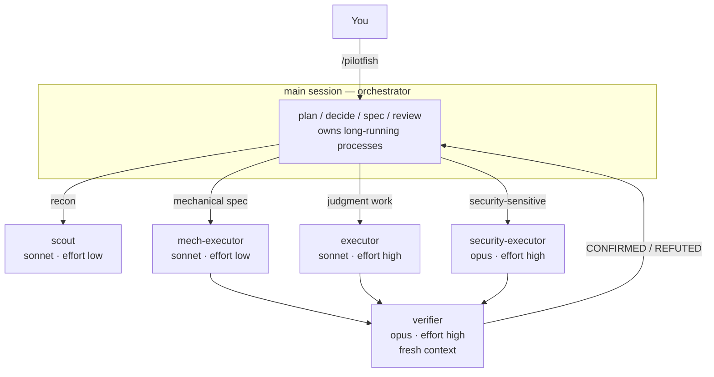

# pilotfish 🐟

> Pilot fish swim alongside the ocean's largest predators — small, fast, and doing the routine work so the big one doesn't have to.

**pilotfish** is a multi-model orchestration plugin for [Claude Code](https://code.claude.com). The frontier model (Claude Fable 5 / Opus) plans, decides, and reviews in your main session; Sonnet does the volume work through five pinned role agents. Quality is protected by fresh-context verification, not by using the biggest model everywhere — and the rules that matter aren't asked for, they're **enforced by a hook**.

```
/plugin marketplace add Nanako0129/pilotfish
/plugin install pilotfish@pilotfish
```

Then type `/pilotfish` to arm it for the session, or `/pilotfish <task>` to arm it and start. It never activates on its own. Nothing is written into your `~/.claude/` config or into your projects; uninstalling (`/plugin uninstall pilotfish`) removes every trace.

One manual step, if you want it: no plugin can set your main-session model, so put the orchestrator on the frontier tier yourself with `/model best` — or persist `{ "model": "best", "fallbackModel": ["opus", "sonnet"] }` in `~/.claude/settings.json`. pilotfish works without it, but the cost argument below assumes a frontier orchestrator.

[繁體中文說明](./README.zh-TW.md)

## Why

**Cost.** Most tokens in a coding session are not judgment — they're searching, mechanical edits, test runs, and doc updates that a cheaper model does just as well. Meanwhile Fable 5 consumes subscription limits ~2× faster than Opus, and agentic sessions with heavy tool use burn far steeper than that in practice.

The split is officially benchmarked, and pilotfish ships exactly the configuration Anthropic measured: a **Fable 5 orchestrator with Sonnet 5 workers reaches 96% of all-Fable performance for 46% of the cost** (BrowseComp: 86.8% vs 90.8% accuracy, $18.53 vs $40.56 per problem — [multi-agent docs](https://platform.claude.com/docs/en/managed-agents/multi-agent)). A community 12-worker audit puts the same split at [58% cheaper](https://www.developersdigest.tech/blog/fable-5-orchestrator-model-playbook) in API dollars ($14.50 → $6.10).

> On subscriptions it's better than the per-token price suggests: the weekly limit is [two buckets](https://support.claude.com/en/articles/14552983-models-usage-and-limits-in-claude-code) — a shared "all models" bucket **plus an additional Sonnet-only bucket**. Routing execution to Sonnet costs less per token *and* draws on headroom the frontier model can't touch.

**Speed.** Sonnet returns tokens faster than Opus, and the two highest-volume roles run at `effort: low`, which removes most of the thinking latency from work that doesn't need it. Independent delegations are spawned in the background and overlap, so wall-clock tracks the slowest agent rather than the sum of them.

The quality you'd expect to lose is bought back by the `verifier` — an independent, fresh-context pass that tries to *refute* the finished work. That's not a hedge: Anthropic's [Fable 5 prompting guide](https://platform.claude.com/docs/en/build-with-claude/prompt-engineering/prompting-claude-fable-5) is explicit that fresh-context verifier subagents outperform self-critique. It's cheaper than it sounds, too — an executor's cost scales with the search space it explores, a verifier's only with the diff it's handed.

## How it works

Three layers, one install: **roles** (`agents/*.md`, each pinning its own model in one line of frontmatter), **policy** (`skills/pilotfish/SKILL.md`, written in terms of roles and never model names, loaded by `/pilotfish`), and the **guard** (`hooks/` + `scripts/guard.py`, which enforces what a policy can only request).



| Role | Model | Effort | Used for |
|---|---|---|---|
| `scout` | sonnet | low | Read-only recon: "where/how is X", symbol usages, config values |
| `mech-executor` | sonnet | low | Fully-specified mechanical work: pattern refactors, convention tests, docs, bulk edits |
| `executor` | sonnet | high | Implementation needing judgment: features, bug fixes, design-sensitive refactors |
| `verifier` | opus | high | Fresh-context adversarial verification; returns CONFIRMED/REFUTED, never fixes |
| `security-executor` | opus | high | Anything security-sensitive — deliberately kept off Fable 5, whose safety classifiers can refuse benign defensive-security work |

`scout`, `mech-executor`, and `executor` are all Sonnet and differ only in effort — which is precisely why they're three files. The `Agent` tool has no `effort` parameter, so frontmatter is the *only* place effort can be set: one role definition means one effort level, and a 30-file rename would run at `high` for nothing.

The policy adds the operating rules: spec delegations in one shot including the *why*, start with the cheapest plausible role and escalate after two failures, let each role take its model only from its own definition, schedule independent work in the background, and gate non-trivial work behind a `verifier` pass before calling it done.

## The guard

A policy is a request. A missing capability is a fact. Three rules that used to be prose are enforced by a `PreToolUse` hook, because prose kept failing:

| | Main session | Subagent |
|---|---|---|
| `run_in_background` | allowed | **denied** |
| `nohup` / `setsid` / trailing `&` | allowed | **denied** |
| built-in `Explore` agent | **denied** → use `scout` | — |

**Subagents may not detach.** When a subagent's foreground command exceeds its `timeout`, Claude Code doesn't kill it — it promotes it to a background task. If the agent was spawned in the background that promoted process survives and its output is collected; if it was spawned in the *foreground* it is `SIGTERM`ed seconds after the agent returns, destroying the work. `nohup` and `setsid` dodge that `SIGTERM` only by escaping Claude Code's task tracking entirely — no task id, no captured output, no notification — which launders a destroyed result into a lost one. So long-running processes belong to the orchestrator, the one context whose background tasks are both tracked and reliably notified.

**The built-in `Explore` is blocked.** Since Claude Code v2.1.198 it inherits your main-session model, so every background search from a Fable/Opus session bills at frontier rates — exactly the cost this plugin exists to avoid. A plugin can't shadow a built-in (plugin agents are namespaced), so the guard denies it and routes recon to `scout`.

Every one of these behaviours was established by experiment, not assumed. The guard is ~100 lines, has no network access, never inspects your code, and **fails open** — a malformed payload always allows the call. It cannot lock you out of your own session. Read it before you install: [`scripts/guard.py`](./scripts/guard.py), the five files in [`agents/`](./agents/), and [`skills/pilotfish/SKILL.md`](./skills/pilotfish/SKILL.md). That's everything.

## More

[**docs/design.md**](./docs/design.md) — why role-based policy, why model aliases over pinned IDs, effort tiering, the fallback story when a tier disappears, tuning knobs, and what was deliberately left out.
[**docs/research.md**](./docs/research.md) — the underlying research: Fable 5's strengths and when it's wasteful, subscription economics, official Claude Code mechanisms, community measurements, with sources ([繁體中文](./docs/research.zh-TW.md)).

**Want OpenAI GPT-5.6 inside Claude Code without changing native Claude state?** [Remora](https://github.com/Nanako0129/remora-cc) packages pilotfish's role-based orchestration pattern into a session-scoped launcher for an existing Anthropic-compatible gateway: its model and gateway overrides disappear with the child process.

**Prior art & credits.** The "smart brain, cheap hands" split is not pilotfish's invention: Anthropic's own engineering writeup ([Decoupling the brain from the hands](https://www.anthropic.com/engineering/managed-agents)) frames it, Claude Code ships [`opusplan`](https://code.claude.com/docs/en/model-config) built in — if all you want is a cheaper session, `/model opusplan` needs no plugin at all — and [Rylaa/fable5-orchestrator](https://github.com/Rylaa/fable5-orchestrator) reached the plugin-with-guard-hooks shape first. pilotfish's contribution is small: five deliberately-few roles instead of a large catalog, a policy that survives model churn because it never names a model, and a guard whose rules were each established by experiment rather than reasoning — including one that overturned this project's own previous advice.

## License

[MIT](./LICENSE)
