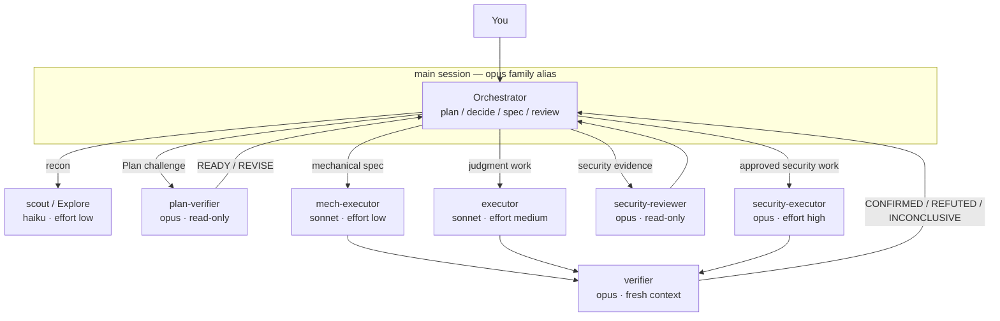

# pilotfish 🐟

> Small, fast role agents handle volume work while the frontier main session
> keeps planning, approval, integration, and final judgment.

**pilotfish** is a global multi-model orchestration policy for
[Claude Code](https://code.claude.com). New installs use the `opus` family for
the main session, Sonnet and Haiku for bounded execution and reconnaissance,
and fresh Opus contexts for risk-triggered review. It installs configuration,
not a runtime service, and writes nothing into your projects.

[繁體中文](./README.zh-TW.md)

## Contents

- [Why](#why)
- [How it works](#how-it-works)
- [Install](#install)
- [Operate](#operate)
- [Documentation](#documentation)
- [Project](#project)

## Why

Most coding-session tokens are spent on search, repetitive edits, tests, and
documentation rather than frontier judgment. pilotfish routes those bounded
paths to cheaper roles while keeping the main session accountable and using
fresh-context reviewers at material acceptance boundaries.

New installs default to the `opus` alias; Fable remains an explicit
`/model fable` choice. This is a cost-aware default, not a claim that one model
wins every task. The rationale and measurements live in
[research](./docs/research.md), the [design notes](./docs/design.md), and
[#23](https://github.com/Nanako0129/pilotfish/issues/23).

| Host or use case | Project |
|---|---|
| Claude Code global policy | This repository |
| Claude Code with session-scoped GPT routing | [remora](https://github.com/Nanako0129/remora-cc) |
| Grok Build | [pilotfish-grok](https://github.com/Nanako0129/pilotfish-grok) |
| Codex CLI | [pilotfish-codex](https://github.com/miyago9267/pilotfish-codex) |

## How it works

| Layer | Installed target | Responsibility |
|---|---|---|
| Machine | `~/.claude/settings.json` | Main-model alias and fallback chain |
| Roles | `~/.claude/agents/*.md` | Model, effort, and capability boundary for each role |
| Policy | `~/.claude/CLAUDE.md` | Dispatch, approval, verification, and long-run behavior |

If `CLAUDE_CONFIG_DIR` is set, all `~/.claude/` paths above move under that
configuration root.


```mermaid
flowchart TD
    U["You"] --> O
    subgraph MAIN["main session — opus family alias"]
        O["Orchestrator
plan / decide / spec / review"]
    end
    O -->|recon| S["scout / Explore
haiku · effort low"]
    O -->|Plan challenge| PV["plan-verifier
opus · read-only"]
    PV -->|READY / REVISE| O
    O -->|mechanical spec| M["mech-executor
sonnet · effort low"]
    O -->|judgment work| E["executor
sonnet · effort medium"]
    O -->|security evidence| SR["security-reviewer
opus · read-only"]
    SR --> O
    O -->|approved security work| SEC["security-executor
opus · effort high"]
    M --> V["verifier
opus · fresh context"]
    E --> V
    SEC --> V
    V -->|CONFIRMED / REFUTED / INCONCLUSIVE| O
```

| Role | Model | Effort | Purpose |
|---|---|---|---|
| `scout` | haiku | low | Read-only repository reconnaissance |
| `Explore` | haiku | low | Broad read-only search without inheriting the main model |
| `plan-verifier` | opus | medium | Pre-approval Plan challenge: `READY` or structured `REVISE` |
| `security-reviewer` | opus | high | Read-only security evidence before approval |
| `mech-executor` | sonnet | low | Fully specified mechanical repetition |
| `executor` | sonnet | medium | Approved implementation requiring local judgment |
| `verifier` | opus | medium | Fresh-context outcome falsification after implementation |
| `security-executor` | opus | high | Approved security-sensitive implementation |

Small, stable work stays in the main session. Larger work is split only when a
bounded role has a stable contract and delegation has positive net benefit.
Risk, not file count, triggers independent review. The exact lifecycle is
defined in the [policy template](./templates/claude-md.orchestration.md) and
explained in the [design rationale](./docs/design.md).

> ⚠️ **Automatic delegation is not guaranteed.** Higher-priority Claude Code
> instructions can suppress Agent dispatch, and user-level `CLAUDE.md` cannot
> override them. When the lifecycle matters, include the following request.

```text
Use pilotfish. Follow its dispatch brake: keep direct work in the main session
and call the named agents only when the policy selects delegation.
```

The bounded results and claim limits are recorded in the
[spontaneous-dispatch benchmark](./benchmarks/spontaneous-dispatch/README.md)
and [`cue-free-tui.json`](./benchmarks/spontaneous-dispatch/cue-free-tui.json).
They are behavioral observations, not a dispatch rate or proof of the active
system-prompt bytes.

## Install

Clone the reviewed release, start Claude Code from that checkout, and ask it to
follow the local runbook:

```bash
git clone --branch v1.3.8 --depth 1 https://github.com/Nanako0129/pilotfish.git
cd pilotfish
claude
```

```text
Read the local file install/AGENT-INSTALL.md in the current checkout and follow
it to install pilotfish into my global Claude Code configuration. Show me the
full plan of changes and get my approval before writing anything.
```

> **Runtime requirement:** Claude Code **2.1.219 or newer**. Restart Claude Code
> after installation so the agent directory and model setting are reloaded.

> ⚠️ **Trust boundary:** the policy loads into every future session. Review the
> pinned checkout, the [agent templates](./templates/agents/), the
> [policy template](./templates/claude-md.orchestration.md), and the
> [install runbook](./install/AGENT-INSTALL.md) before approving writes. Do not
> bypass WebFetch prompt-injection protection to install from a mutable raw URL.

| Target | Installed change | Reversible |
|---|---|---|
| `settings.json` | Adds missing `model` and `fallbackModel` keys; preserves existing choices unless approved | Yes |
| `agents/` | Eight role-agent files | Yes |
| `CLAUDE.md` | One versioned `pilotfish:begin/end` policy block | Yes |

The installer is idempotent and shows a merge plan before writing. Human-readable
steps, backups, collision handling, verification, updates, and uninstall are all
in [install/AGENT-INSTALL.md](./install/AGENT-INSTALL.md).

## Operate

| Task | Where to go |
|---|---|
| Tune models, effort, delegation, or managed settings | [Usage guide](./docs/usage.md) |
| Update an existing install | [Runbook: Updating an existing install](./install/AGENT-INSTALL.md#updating-an-existing-install) |
| Review release changes | [CHANGELOG.md](./CHANGELOG.md) |
| Disable pilotfish for one project | Use a separate `CLAUDE_CONFIG_DIR`; details are in the [usage guide](./docs/usage.md#disable-update-or-uninstall) |
| Uninstall safely | [Runbook: Uninstall](./install/AGENT-INSTALL.md#uninstall) |

To delegate uninstall to Claude Code:

```text
Read the local install/AGENT-INSTALL.md, resolve the Claude Code configuration
root exactly as Step 0 specifies, and follow its Uninstall section. In that
configuration root, remove the eight pilotfish agent files and policy block.
Show me the full removal and settings-restoration plan and get my approval
before writing.
```

## Documentation

| Topic | Document |
|---|---|
| Daily use and troubleshooting | [docs/usage.md](./docs/usage.md) · [繁體中文](./docs/usage.zh-TW.md) |
| Architecture and policy decisions | [docs/design.md](./docs/design.md) |
| Model economics and source research | [docs/research.md](./docs/research.md) · [繁體中文](./docs/research.zh-TW.md) |
| Real long-session field report | [docs/field-report-tokscale-2026-07.zh-TW.md](./docs/field-report-tokscale-2026-07.zh-TW.md) |
| Behavioral evidence and claim limits | [dispatch brake](./benchmarks/dispatch-brake/README.md) · [spontaneous dispatch](./benchmarks/spontaneous-dispatch/README.md) · [Baton activation](./benchmarks/baton-dispatch-effect/README.md) · [prompt compression](./benchmarks/prompt-compression/README.md) · [verifier boundary](./benchmarks/verifier-boundary/README.md) |
| Contribution and evidence contracts | [CONTRIBUTING.md](./CONTRIBUTING.md) |

## Project

pilotfish is MIT licensed. Behavioral compatibility claims require paid model
runs, fresh verification, and maintained evidence; sponsorship helps fund those
gates.

[](https://www.patreon.com/cw/Nanako0129/membership)

[License](./LICENSE) · [Contributing](./CONTRIBUTING.md)
