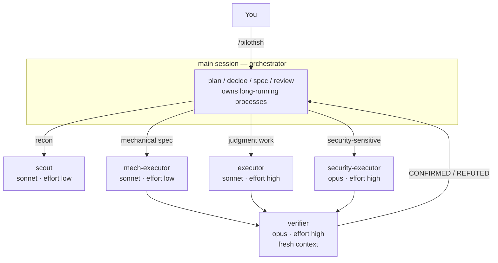

# pilotfish 🐟

> 領航魚與海中最大的掠食者同游——小而快，把例行工作攬下來，讓大傢伙專心做只有牠能做的事。

**pilotfish** 是 [Claude Code](https://code.claude.com) 的多模型協作 plugin：前沿模型（Claude Fable 5 / Opus）在主 session 負責規劃、決策與審查，Sonnet 則透過五個釘住模型的角色 agent 承接大量執行工作。品質靠 fresh-context 驗證把關，而不是靠處處使用最大的模型。它就是純粹的 markdown 與 JSON——沒有 hook、沒有直譯器、沒有任何 runtime 依賴——所以無論 Claude Code 跑在哪裡都能用，包含原生 Windows。

```
/plugin marketplace add Nanako0129/pilotfish
/plugin install pilotfish@pilotfish
```

接著輸入 `/pilotfish`，這個 session 接下來就照這套方式跑；或直接 `/pilotfish <任務>`，掛上之後立刻開始處理。它絕不自行啟動。不會寫入你的 `~/.claude/` 設定，也不會寫入你的專案；移除（`/plugin uninstall pilotfish`）不留下一絲痕跡。

有一個手動步驟，看你要不要做：任何 plugin 都無法設定你的主 session 模型，所以請自己把 orchestrator 放到前沿層級——`/model best`，或寫進 `~/.claude/settings.json` 常駐：`{ "model": "best", "fallbackModel": ["opus", "sonnet"] }`。不做這步 pilotfish 一樣能用，只是底下的成本論證假設了一個前沿 orchestrator。

[English](./README.md)

## 為什麼

**成本。** 一個 coding session 裡大多數 token 並*不是*「判斷」——是搜尋、機械性編輯、跑測試、更新文件，這些工作便宜的模型做得一樣好。而 Fable 5 消耗訂閱額度的速度**約為 Opus 的 2 倍**，重度使用工具的 agentic session 實際消耗還要陡得多。

這套分工有官方 benchmark，而 pilotfish 出貨的正是 Anthropic 測過的那個配置：**Fable 5 orchestrator + Sonnet 5 workers 達到全 Fable 效能的 96%、成本只要 46%**（BrowseComp：準確率 86.8% vs 90.8%、每題 $18.53 vs $40.56——[multi-agent 文件](https://platform.claude.com/docs/en/managed-agents/multi-agent)）。社群一次 12-worker 稽核實驗以 API 美元計價，替同一套分工算出[便宜 58%](https://www.developersdigest.tech/blog/fable-5-orchestrator-model-playbook)（$14.50 → $6.10）。

> 在訂閱方案上，實際效果比單價看起來更好：每週限額是[兩個桶](https://support.claude.com/en/articles/14552983-models-usage-and-limits-in-claude-code)——共用的「所有模型」桶之外，另有一個 **Sonnet 專用的額外桶**。把執行工作路由給 Sonnet 不只單價便宜，*還能*動用前沿模型碰不到的那份額度。

**速度。** Sonnet 吐 token 比 Opus 快，而兩個工作量最大的角色跑在 `effort: low`——把不需要深度思考的工作上那層思考延遲拿掉了大半。可獨立推進的委派會放到背景並行推進，於是實際耗時跟的是最慢的那個 agent，而不是每個 agent 的時間相加。

你以為會損失的品質，由 `verifier` 買回來——獨立、fresh-context、以*推翻*完成品為目標的一輪驗證。這不是保險起見：Anthropic 的 [Fable 5 prompting 指南](https://platform.claude.com/docs/en/build-with-claude/prompt-engineering/prompting-claude-fable-5)明講「獨立的 fresh-context 驗證者 subagent 效果優於模型自我批判」。它也比聽起來便宜——executor 的成本隨它要探索的搜尋空間放大，verifier 的成本只隨遞到它手上的 diff 放大。

## 運作方式

兩層架構，一次安裝：**角色層**（`agents/*.md`，每個角色用一行 frontmatter 把自己釘在某個模型上）與**政策層**（`skills/pilotfish/SKILL.md`，只寫角色、永不寫模型名，輸入 `/pilotfish` 時載入）。政策的規則沒有任何機制強制執行——這個取捨與代價見下方[〈為什麼沒有守衛〉](#為什麼沒有守衛)。



| 角色 | 模型 | Effort | 用途 |
|---|---|---|---|
| `scout` | sonnet | low | 唯讀查找：「X 在哪／怎麼運作」、symbol 用法、設定值 |
| `mech-executor` | sonnet | low | 規格完整的機械性工作：pattern 重構、照慣例寫測試、文件、批次編輯 |
| `executor` | sonnet | high | 需要判斷的實作：功能開發、bug 修復、涉及設計的重構 |
| `verifier` | opus | high | Fresh-context 對抗式驗證；回報 CONFIRMED/REFUTED，永不動手修 |
| `security-executor` | opus | high | 一切資安相關工作——刻意不走 Fable 5，其安全分類器可能誤拒良性的防禦性資安工作 |

`scout`、`mech-executor`、`executor` 三個都是 Sonnet，只差在 effort——而這正是它們得是三個檔案的原因。`Agent` 工具**沒有 `effort` 參數**，frontmatter 是*唯一*能設定 effort 的地方：一份角色定義就等於一個 effort 等級，否則一次 30 個檔案的機械性改名會白白跑在 `high` 上。

政策層補上運作規則：委派時一次給完整規格（含背後的「*為什麼*」）、從最便宜的可行角色開始並在兩次失敗後升級、每個角色的 model 只能來自它自己的 agent 定義、可獨立推進的工作放到背景排程、非平凡的工作在回報完成前必須通過一輪 `verifier` 驗證。

## 為什麼沒有守衛

pilotfish 有兩條規則，是 subagent 原本可能不理會的。用一個 `PreToolUse` hook 把能力直接拿掉、而不是拜託模型別用，看起來很自然——畢竟「鎖住的門勝過一張『請勿進入』的告示」：模型根本沒有機會拿規則跟眼前的任務去權衡。pilotfish 刻意不這麼做。這裡誠實說明原因，以及你因此付出的代價。

Hook 是一支 script，script 就需要直譯器——而 Claude Code 並不保證機器上有。依官方文件，跑 Claude Code 的機器上**不保證**存在任何直譯器：不只 Python，就連 Node 也一樣，原生／standalone 安裝方式甚至不會把 `node` 放進 `PATH`。原生 Windows 是最硬的那道牆：它既不認 `#!` shebang、也不認 Unix 可執行權限位元，所以「寫一支 script、標成可執行、直接呼叫」這種慣用的 hook 形狀，本質上就是 Unix 限定，在 Windows 上連啟動都做不到。一個外掛只要帶了直譯型 hook，就不可能在 Claude Code 能跑的每個地方都跑得動——而 pilotfish 的前提正是「哪裡都能跑」：零依賴，純 markdown 與 JSON。

真正拍板的是失敗模式。守衛 hook 必須 **fail open**——畸形的 payload 一定要放行，否則守衛自己一個 bug 就能把你鎖在自己的 session 外面。但「直譯器根本不存在」同樣是 fail open，而且是**無聲**的：偏偏就在那些 hook 跑不起來的機器上，你既沒有強制力，也收不到任何「強制力不在了」的訊號。這比不出貨還糟，因為你以為被守住的規則，你就不會再自己盯著。**一扇不存在的門，勝過一扇你誤以為鎖上的門。** 所以強制力留在政策層：規則明文寫在 [`skills/pilotfish/SKILL.md`](./skills/pilotfish/SKILL.md) 裡，subagent 讀得到，原則上也可以不理。通用可攜性就是這筆交易換來的東西。以下是只靠政策 prompt 撐著的兩條規則：

- **絕不呼叫內建的 `Explore` agent。** 自 Claude Code v2.1.198 起，它會繼承主 session 的模型，因此從 Fable／Opus session 發出的每一次搜尋都以前沿模型的價格計費——正是這個 plugin 存在要避免的成本。Plugin 無法覆蓋內建 agent（plugin agent 帶 namespace），所以也不能靠繞路解決：每次都改用 `pilotfish:scout`，同一個唯讀偵察角色，釘在 Sonnet、effort 低。
- **Subagent 不准 detach 一個 process**（`run_in_background`、`nohup`、`setsid`、`disown`、尾隨的 `&`）。當 subagent 的前景指令超過它的 `timeout`，Claude Code 並不會殺掉它——而是把它升級為背景任務。如果這個 agent 當初是在背景 spawn 的，被升級的 process 會存活、輸出會被擷取；如果是在**前景** spawn 的，它會在該 agent 回傳後幾秒內收到 `SIGTERM`，工作就此被摧毀。Detach 躲得掉那個 `SIGTERM`，靠的卻是徹底脫離 Claude Code 的任務追蹤——沒有 task id、沒有擷取的輸出、沒有完成通知——只是把「被摧毀的結果」洗成「遺失的結果」。所以長時間執行的 process 屬於 orchestrator：主 session 是唯一一個背景任務既被追蹤、又能可靠收到通知的 context。

以上兩條規則都是實驗確立的，不是推測出來的，也都以指示的形式寫在 orchestrating session 會載入的 skill prompt 裡——確切文字見 [`skills/pilotfish/SKILL.md`](./skills/pilotfish/SKILL.md)。沒有任何機制會把能力拿掉：不理會指示的 subagent，不會被擋下來。這就是它誠實的樣子。

## 更多

[**docs/design.md**](./docs/design.md) — 為什麼政策以角色撰寫、為什麼用 model alias 而不釘死版本 ID、effort 分層、某一層模型消失時的 fallback 機制、調校旋鈕，以及刻意不做的事。
[**docs/research.md**](./docs/research.md) — 底層研究：Fable 5 的強項與何時浪費、訂閱經濟學、Claude Code 官方機制、社群實測數字，附來源（[繁體中文](./docs/research.zh-TW.md)）。

**想在 Claude Code 裡使用 OpenAI GPT-5.6，又不改動原生 Claude state？** [Remora](https://github.com/Nanako0129/remora-cc) 把 pilotfish 的角色分工模式包裝成 session-scoped launcher，接到既有的 Anthropic-compatible gateway：它的 model 與 gateway override 會隨 child process 一起消失。

**先行者與致意。** 「聰明的腦、便宜的手」這個分工不是 pilotfish 發明的：Anthropic 自己的工程文（[Decoupling the brain from the hands](https://www.anthropic.com/engineering/managed-agents)）就是這個框架，Claude Code 內建 [`opusplan`](https://code.claude.com/docs/en/model-config)——如果你只想要更省的 session，`/model opusplan` 根本不需要裝任何 plugin——而 [Rylaa/fable5-orchestrator](https://github.com/Rylaa/fable5-orchestrator) 更早就探索過「plugin + 強制 hook」這個形狀——pilotfish 刻意不走這條路，理由見[為什麼沒有守衛](#為什麼沒有守衛)。pilotfish 的貢獻很小：刻意只有五個角色而非一大本 agent 目錄、寫成角色而能撐過模型換代的政策、以及每一條規則都由實驗（而非推理）確立——其中一條還推翻了本專案自己先前的建議。

## 授權

[MIT](./LICENSE)
