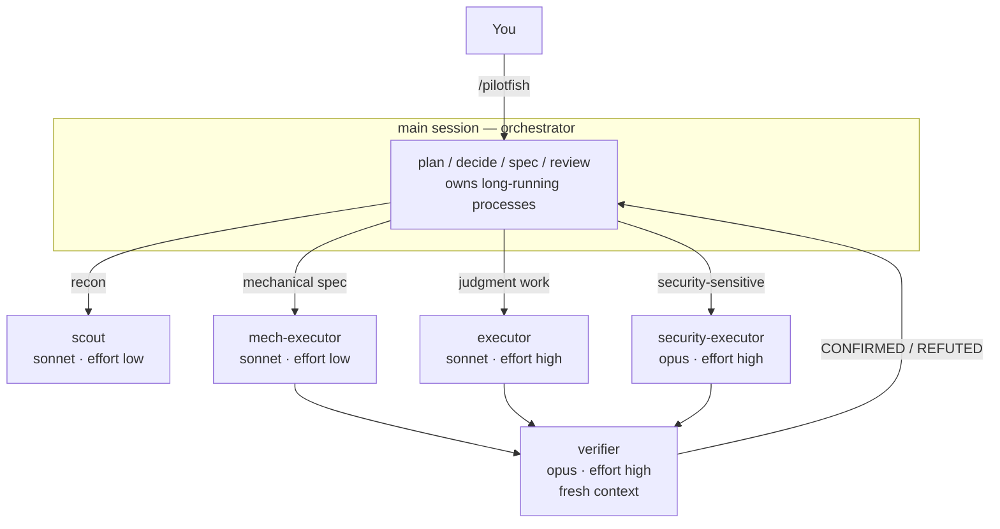

# pilotfish 🐟

> 領航魚與海中最大的掠食者同游——小而快，把例行工作攬下來，讓大傢伙專心做只有牠能做的事。

**pilotfish** 是 [Claude Code](https://code.claude.com) 的多模型協作 plugin：前沿模型（Claude Fable 5 / Opus）在主 session 負責規劃、決策與審查，便宜的模型（Sonnet，需要的角色才用 Opus）透過角色 agent 承接大量執行工作。品質靠 fresh-context 驗證把關，而不是靠處處使用最大的模型。

```
/plugin marketplace add Nanako0129/pilotfish
/plugin install pilotfish@pilotfish
```

接著輸入 `/pilotfish`，這個 session 接下來就照這套方式跑。不會寫入你的 `~/.claude/` 設定，也不會寫入你的專案；移除時不留下任何痕跡。（[完整安裝說明](#安裝)。）

真正重要的規則不是「請求」——而是**由 hook 強制執行**。見[守衛](#守衛)。

> **想在 Claude Code 裡使用 OpenAI GPT-5.6，又不改動原生 Claude state？** [Remora](https://github.com/Nanako0129/remora-cc) 把 pilotfish 的角色分工模式包裝成 session-scoped launcher，連接既有的 Anthropic-compatible gateway。想走原生 Claude Code 路線，可以使用 pilotfish；想要經過批准、可驗證，而且 model 與 gateway override 會隨 child process 消失的安裝方式，可以使用 Remora。

[English](./README.md)

## 目錄

- [為什麼](#為什麼)
- [運作方式](#運作方式)
- [守衛](#守衛)
- [安裝](#安裝)
- [使用方式](#使用方式)
- [信任與安全](#信任與安全)
- [Fallback 機制](#fallback-機制)
- [調校與常見問題](#調校與常見問題)
- [研究與設計](#研究與設計)
- [移除](#移除)
- [授權](#授權)

## 為什麼

前沿模型的 session 貴在訂閱者最痛的地方：Claude Fable 5 消耗訂閱額度的速度**約為 Opus 的 2 倍**（官方 UI 原文），而重度使用工具的 agentic session 實際消耗還要陡得多。但一個 coding session 裡大多數 token 並*不是*「判斷」——是搜尋、機械性編輯、跑測試、更新文件，這些工作便宜的模型做得一樣好。

這套做法的每一塊都有 Anthropic 背書。[Fable 5 prompting 指南](https://platform.claude.com/docs/en/build-with-claude/prompt-engineering/prompting-claude-fable-5)建議頻繁委派 subagent，並指出「**獨立的 fresh-context 驗證者 subagent 效果優於模型自我批判**」。而 2026-07-08 起，「便宜模型執行」的分工也有了官方 benchmark：Anthropic 自家測試中 **Fable 5 orchestrator + Sonnet 5 workers 達到全 Fable 效能的 96%、成本只要 46%**（BrowseComp：準確率 86.8% vs 90.8%、每題 $18.53 vs $40.56）（[multi-agent 文件](https://platform.claude.com/docs/en/managed-agents/multi-agent)）。社群實驗在業餘規模指向同一方向——高度委派的 12-worker 稽核（[Developers Digest](https://www.developersdigest.tech/blog/fable-5-orchestrator-model-playbook)），偏最佳情境、API 美元計價：

| 配置（12-worker 稽核實驗，Developers Digest） | 成本 | 節省 |
|---|---|---|
| 全程 Fable 5 | $14.50 | — |
| Fable 5 協調 + Sonnet workers | $6.10 | 58% |

pilotfish 實際出貨的就是 Sonnet worker 那一列：執行角色一律 Sonnet，而兩個不能便宜的角色——`verifier` 與 `security-executor`——用 Opus。

> **提示：** Claude 訂閱採雙桶每週限額（[官方文章](https://support.claude.com/en/articles/14552983-models-usage-and-limits-in-claude-code)）——共用的「所有模型」桶之外，另有一個 **Sonnet 專用的額外桶**。把執行工作路由給 Sonnet agent 不只單價便宜，*還能*動用這份額外的專屬額度。

> **注意：** 以上是訂閱方案的機制。在按 token 計費的 API 上，單價層面的節省依然成立（只是沒有週額度桶）。在 Bedrock / Vertex / Foundry 上，alias 會解析到各平台的內建預設版本，Fable 5 未必開通。

## 運作方式

三層架構，一次安裝：

| 層 | 位置 | 職責 |
|---|---|---|
| 角色層 | `agents/*.md` | 五個角色 agent，各用一行 frontmatter 綁定到正確的模型層級 |
| 政策層 | `skills/pilotfish/SKILL.md` | 規範「*怎麼*委派」——只寫角色，永不寫模型名。輸入 `/pilotfish` 時載入 |
| **守衛** | `hooks/` + `scripts/guard.py` | 強制執行政策只能「請求」的規則 |



五個角色：

| 角色 | 模型 | Effort | 用途 |
|---|---|---|---|
| `scout` | sonnet | low | 唯讀查找：「X 在哪／怎麼運作」、symbol 用法、設定值 |
| `mech-executor` | sonnet | low | 規格完整的機械性工作：pattern 重構、照慣例寫測試、文件、批次編輯 |
| `executor` | sonnet | high | 需要判斷的實作：功能開發、bug 修復、涉及設計的重構 |
| `verifier` | opus | high | Fresh-context 對抗式驗證；回報 CONFIRMED/REFUTED，永不動手修 |
| `security-executor` | opus | high | 一切資安相關工作——刻意不走 Fable 5，其安全分類器可能誤拒良性的防禦性資安工作 |

其中三個角色都是 Sonnet，只差在 effort——看起來多餘，直到你去看 `Agent` 工具的參數。它接受 `model`，但**沒有 `effort` 參數**：effort 只能寫在 frontmatter 裡。也就是說，一份角色定義就等於它此後接到的每一件事都固定同一個 effort 等級；把這幾個角色併成一個，等於讓一次 30 個檔案的機械性改名白白跑在 `effort: high` 上。三個檔案是這套 harness 為三條 effort 車道提供的唯一機制。

政策層補上運作規則：委派時一次給完整規格（含背後的「*為什麼*」）、從最便宜的可行角色開始並在兩次失敗後升級、每個角色的 model 只能來自它自己的 agent 定義、可獨立推進的工作放到背景排程、非平凡的工作在回報完成前必須通過 `verifier` 驗證。

## 守衛

政策是一個請求；能力缺席才是事實。有三條規則過去只是文字，現在由 `PreToolUse` hook 強制執行——因為光靠文字一再失效：

| | 主 session | Subagent |
|---|---|---|
| `run_in_background` | 允許 | **拒絕** |
| `nohup` / `setsid` / 尾隨的 `&` | 允許 | **拒絕** |
| 內建 `Explore` agent | **拒絕** → 改用 `scout` | — |

**為什麼 subagent 不能 detach。** 當 subagent 的前景指令超過它的 `timeout`，Claude Code 並不會殺掉它——而是把它**升級為背景任務**，並回報「*完成時會通知你*」。這個承諾是否成立，取決於 orchestrator 當初是怎麼 spawn 這個 agent 的：

- 以 **`run_in_background: true`** spawn → 被升級的 process 會存活、跑到完成、輸出被擷取，通知也會重新喚起該 agent。**安全。**
- 在**前景**spawn → 被升級的 process 會在該 agent 回傳後幾秒內收到 `SIGTERM`。**工作被摧毀，擷取到的輸出也在半途被截斷。**

`nohup` 與 `setsid` 靠脫離 process group 躲掉那個 `SIGTERM`——這正是這個寫法被採用的原因——但它們同時也脫離了 Claude Code 的任務追蹤：沒有 task id、沒有擷取的輸出、沒有完成通知。結果是一個沒有人會去收的孤兒 process。Detach 救不了這次交接；它只是把「被摧毀的結果」洗成「遺失的結果」。

所以 subagent 根本不准 detach。它們在前景執行指令、明確設定 `timeout`，並把任何無法在一個 timeout 內完成的工作交回上層。**長時間執行的 process 屬於 orchestrator**——主 session 是唯一一個背景任務既被追蹤、又能可靠收到通知的 context。

這也是為什麼政策堅持要用 `run_in_background: true` 來 spawn agent。這不只是更便宜、更能平行：它決定了一個 agent 的長指令是跑完，還是被殺掉。

**為什麼內建的 `Explore` 被擋。** 自 Claude Code v2.1.198 起，內建的 `Explore` agent 會繼承主 session 的模型，因此從 Fable／Opus session 發出的每一次背景搜尋都以前沿模型的價格計費。Plugin 無法覆蓋內建 agent（plugin agent 帶 namespace），所以 pilotfish 直接擋掉它，把偵察工作路由到釘在 Sonnet、跑 low effort 的 `scout`。

以上每一項行為都是實驗確立的，不是推測出來的。守衛採 fail open：畸形的 payload 絕不會弄壞你的 session。

## 安裝

```
/plugin marketplace add Nanako0129/pilotfish
/plugin install pilotfish@pilotfish
```

接著重啟 Claude Code，或執行 `/reload-plugins` 讓目前的 session 直接吃到。

安裝就這樣。不會寫入你的 `~/.claude/` 設定，也不會寫入你的任何專案——這個 plugin 是自包含的，移除時不留一絲痕跡。

**有一個手動步驟，看你要不要做。** Plugin 無法設定你的主 session 模型（任何 plugin 都不行）。想讓 orchestrator 跑在當前最好的前沿模型上，請自己設定：

```
/model best
```

或寫進 `~/.claude/settings.json` 常駐：

```json
{ "model": "best", "fallbackModel": ["opus", "sonnet"] }
```

不做這步 pilotfish 一樣能用——角色 agent 的模型綁定不受影響——只是你不會得到成本論證所假設的那個前沿 orchestrator。

**更新**是自動的：版本更新的 release 會經由 marketplace 送達。用 `/plugin` → Marketplaces 來控制它。

## 使用方式

```
/pilotfish
```

替這個 session 的其餘部分掛上 pilotfish。從此你提出的每件事都會被協調——偵察給 `scout`、機械性工作給 `mech-executor`、需判斷的工作給 `executor`，任何東西在被稱為「完成」之前都要先過一輪 `verifier`。

```
/pilotfish sort out gh issue 42
```

一樣的效果，而且會立刻開始處理那個任務。

兩者都是明確叫用的——pilotfish 絕不自行啟動。

## 信任與安全

pilotfish 安裝的是一個 plugin，內含五個 agent 定義、一個 skill、一個 hook script。這個 hook（`scripts/guard.py`）會在每一次 `Bash` 與 `Agent` 工具呼叫時執行，所以安裝前請先讀它——它大約 100 行，而且只做一件事：拒絕一小組呼叫，其餘全部放行。它不檢查你的程式碼、不對外回傳、沒有網路存取。

- **實際會跑的位元組要親自讀過：** [`scripts/guard.py`](./scripts/guard.py)、[`agents/`](./agents/) 底下的五個檔案，以及 [`skills/pilotfish/SKILL.md`](./skills/pilotfish/SKILL.md)。就這些。
- **釘選版本：** marketplace 條目有版本；安裝即釘選到某個 release，只有你自己決定要動時才會動。
- **守衛採 fail open。** 解析不了 payload 時就放行。它不可能把你鎖在自己的 session 外面。

## Fallback 機制

前沿模型消失時整套架構照常運作，因為政策文字從不指名模型：

| 失效情境 | 誰接住 | 你要做什麼 |
|---|---|---|
| Fable 5 離開你的方案 | `best` 重新解析為最新 Opus | 大概什麼都不用做。切勿釘死 `fable`／完整 ID：2026 年 6 月釘死 ID 的人收到硬性錯誤 |
| 模型過載／API 錯誤 | `fallbackModel: ["opus", "sonnet"]` 自動切換 | 不用做 |
| 某層模型被棄用（Opus 4.8 → 4.9） | 角色 agent 用 alias（`opus`、`sonnet`），自動跟隨官方推薦版本 | 不用做 |
| 前沿模型在任務中途拒絕資安工作 | 資安工作一開始就路由給 `security-executor`（Opus），根本不會碰到分類器 | 不用做 |

政策只講角色。模型綁定只存在一個地方——每個 agent 檔的一行 frontmatter——要改指向某一層，改一行、處處生效。

## 調校與常見問題

| 問題 | 回答 |
|---|---|
| 想省更多額度 | 主 session 切 `/model opusplan`——plan mode 用 Opus 思考、執行切 Sonnet。底下的角色 agent 照常運作。 |
| 能強制所有 subagent 用同一個模型嗎？ | `CLAUDE_CODE_SUBAGENT_MODEL` 會覆蓋*所有* agent 的 frontmatter——所以 pilotfish 不設它。別去設它。 |
| 我有把 `availableModels` 當白名單用 | 那名單必須包含 agents 用到的所有 alias（`opus`、`sonnet`），否則那些 agent 會被靜默降級為繼承主 session 模型。 |
| 為什麼便宜角色都設 `effort: low`？ | Effort 是第二大額度槓桿。Fable 5 世代的模型在 low effort 常已達前代 `xhigh` 的水準；偵察與機械性工作不需要深度思考。 |
| 主 session 用哪個 effort？ | `high`。Fable 5 官方建議：大多數工作用 `high`，`xhigh` 只留給最長時程的任務。 |
| Orchestrator 自己完全不動手嗎？ | 會動手——馬上要用的單檔閱讀、決策、以及你明確要*它*判斷的事。委派有開銷，政策裡寫明了。 |
| Spawn agent 不是有額外成本嗎？ | 有——每次 spawn 都是全新 context、要重讀它負責的那部分 codebase，寫規格也花主 session 的 token。這正是政策規定「單檔閱讀與快速判斷不委派」的原因。省的地方在大量工作：便宜層的單價差距遠大於 spawn 開銷。 |
| 擔心 subagent 品質 | 這正是 `verifier` 的職責：獨立 fresh-context、以*推翻*工作為目標的驗證。官方口徑：fresh-context 驗證者優於自我批判。 |
| 守衛擋掉了我真正想做的事 | 在 subagent 裡，那正是它的用意——把那條長指令交回 orchestrator，由它安全地執行。如果守衛在你的情境下判斷錯誤，請帶著那條指令開 issue；誤判就是 bug。 |
| 怎麼關掉 | 不要輸入 `/pilotfish` 就好。政策只有在你叫用時才載入。要連守衛一起移除，執行 `/plugin uninstall pilotfish`。 |
| 公司管的機器（managed）？ | Managed settings 優先於使用者層設定。重啟後角色沒生效就找管理員——pilotfish 不會（也不該）繞過管理政策。 |

## 研究與設計

| 文件 | 語言 | 內容 |
|---|---|---|
| [docs/research.md](./docs/research.md) | English | 完整研究發現：Fable 5 的強項與何時浪費、訂閱經濟學、Claude Code 官方機制、社群實測數字——附來源 |
| [docs/research.zh-TW.md](./docs/research.zh-TW.md) | 繁體中文 | 研究報告原版 |
| [docs/design.md](./docs/design.md) | English | 為什麼政策以角色撰寫、為什麼用 alias 不釘版本、effort 分層、以及刻意不做的事 |

**先行者與致意。** 「聰明的腦、便宜的手」這個分工不是 pilotfish 發明的：Anthropic 自己的工程文（[Decoupling the brain from the hands](https://www.anthropic.com/engineering/managed-agents)）就是這個框架，Claude Code 內建 [`opusplan`](https://code.claude.com/docs/en/model-config)——如果你只想要更省的 session，`/model opusplan` 根本不需要裝任何 plugin——而 [Rylaa/fable5-orchestrator](https://github.com/Rylaa/fable5-orchestrator) 更早就做出「plugin + 強制 hook」這個形狀。pilotfish 的貢獻很小：刻意只有五個角色而非一大本 agent 目錄、寫成角色而能撐過模型換代的政策、以及每一條規則都由實驗（而非推理）確立的守衛——其中一條還推翻了本專案自己先前的建議。

## 移除

```
/plugin uninstall pilotfish
```

就這樣。plugin 以外的地方沒有寫入任何東西。

## 授權

[MIT](./LICENSE)
