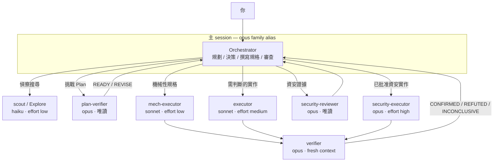

# pilotfish 🐟

> 領航魚與海中最大的掠食者同游——小而快，把例行工作攬下來，讓大傢伙專心做只有牠能做的事。

**pilotfish** 是 [Claude Code](https://code.claude.com) 的多模型協作層：`opus` family 在主 session 負責規劃與決策，Sonnet 與 Haiku 透過全域 subagent 承接大量執行工作，再由 fresh Opus context 挑戰 Plan 與完成結果。品質靠獨立驗證把關，而不是靠處處使用最大的模型。所有設定安裝在全域層——設定一次、所有專案生效——而且整套架構在主模型不可用時能無感降級。

> **想在 Claude Code 裡使用 OpenAI GPT-5.6，又不改動原生 Claude state？** [remora](https://github.com/Nanako0129/remora-cc) 把 pilotfish 的角色分工模式包裝成 session-scoped launcher，連接既有的 Anthropic-compatible gateway。想研究或客製全域 orchestration policy，可以使用 pilotfish；想要經過批准、可驗證，而且 model 與 gateway override 會隨 child process 消失的安裝方式，可以使用 remora。

> **想在 Grok Build 上跑同一套編排？** [pilotfish-grok](https://github.com/Nanako0129/pilotfish-grok) 把角色 lifecycle 與能力邊界移植到 `~/.grok/`（agents、roles、無模型名政策）。Claude Code 用本 repo；宿主是 Grok Build 時用 pilotfish-grok——安裝面獨立，不寫入 `~/.claude/`。

**這個專案的由來：** 某天早上我的週額度重置了，拿到新一週的 Fable 5 額度後做的第一件事，是要它研究上一週的額度為什麼蒸發。這個 repo 就是那次研究的落地成果，也是我現在每個專案每天都在跑的設定——三個設定檔，沒有任何 runtime 程式碼。附出處的研究筆記在 [docs/](./docs/)。

[English README](./README.md)

## 目錄

- [為什麼](#為什麼)
- [運作方式](#運作方式)
- [安裝](#安裝)
- [信任與安全](#信任與安全)
- [安裝內容](#安裝內容)
- [更新](#更新)
- [Fallback 機制](#fallback-機制)
- [調校與常見問題](#調校與常見問題)
- [研究與設計](#研究與設計)
- [參與貢獻](#參與貢獻)
- [移除](#移除)
- [支持 pilotfish](#支持-pilotfish)
- [授權](#授權)

## 為什麼

Anthropic 在 2026-07-24 發布 [Opus 5](https://www.anthropic.com/news/claude-opus-5)，官方定位是接近 Fable 5 的智慧、API 價格只有一半。Opus 5 在 Anthropic 公布的多項評測領先，但不是每一項都贏。因此 pilotfish 把**新安裝**預設改成 `opus` family alias，Fable 5 改為明確使用 `/model fable` 才啟用。這是成本導向的預設值，不是宣稱 Opus 5 全面勝過 Fable 5；決策與 rollback 條件記錄在 [#23](https://github.com/Nanako0129/pilotfish/issues/23)。

原本 7 月的研究仍然解釋了這套架構：前沿模型 session 昂貴，但 coding session 裡大多數 token 是搜尋、機械性編輯、跑測試與更新文件，而不是判斷。這些高量工作可以交給 Sonnet 或 Haiku，接受邊界再用 fresh Opus context 審查。

這套做法的每一塊現在都有 Anthropic 背書。[Fable 5 prompting 指南](https://platform.claude.com/docs/en/build-with-claude/prompt-engineering/prompting-claude-fable-5)建議頻繁委派 subagent，並指出「**獨立的 fresh-context 驗證者 subagent 效果優於模型自我批判**」；而 2026-07-08 起，「便宜模型執行」也有了官方 benchmark：Anthropic 自家測試中 **Fable 5 orchestrator + Sonnet 5 workers 達到全 Fable 效能的 96%、成本只要 46%**（BrowseComp：準確率 86.8% vs 90.8%、每題 $18.53 vs $40.56），反向的 advisor 模式（Sonnet 執行、諮詢 Fable）則是約 92% 效能、63% 成本（SWE-bench Pro）——pilotfish 採用的 orchestrator 分工在兩個軸上都勝出（[multi-agent 文件](https://platform.claude.com/docs/en/managed-agents/multi-agent)）。社群實驗在業餘規模指向同一方向——高度委派的 12-worker 稽核（[Developers Digest](https://www.developersdigest.tech/blog/fable-5-orchestrator-model-playbook)），偏最佳情境、API 美元計價：

| 配置（12-worker 稽核實驗，Developers Digest） | 成本 | 節省 |
|---|---|---|
| 全程 Fable 5 | $14.50 | — |
| Fable 5 協調 + Sonnet workers | $6.10 | 58% |
| Fable 5 協調 + Haiku workers | $3.70 | 74% |

訂閱制用戶還能疊加兩個額外紅利：

> **提示：** Claude 訂閱採雙桶每週限額（[官方文章](https://support.claude.com/en/articles/14552983-models-usage-and-limits-in-claude-code)）——共用的「所有模型」桶之外，另有一個 **Sonnet 專用的額外桶**。把執行工作路由給 Sonnet subagent 不只單價便宜，還能動用這份額外的專屬額度。（Sonnet 用量仍會計入「所有模型」桶——這是額外配額，不是完全獨立的池子。）

> ⚠️ **警告：** Claude Code v2.1.198 起，內建的 `Explore` subagent 會繼承主 session 的模型。如果你的主 session 跑 Fable 5 或 Opus，每一次背景搜尋都在燒 Opus 級的 token（Claude API 上 Explore 繼承的模型以 Opus 封頂；第三方平台無此上限）。pilotfish 會把它覆寫回 Haiku。（坦白揭露一個代價：自訂的 Explore 會像一般 subagent 一樣載入你的使用者記憶，而內建版會跳過——政策區塊對 subagent 角色會自我停用，把這個開銷壓到最小。）

> **注意：** 上面兩點是訂閱方案的機制。在按 token 計費的 API 上，單價層面的節省依然成立（但沒有週額度桶）。Model alias 仍受 provider、帳號與 settings 影響：已記錄的乾淨 first-party Gate 把 `opus` 解析成 Opus 5，同一版 client 載入 user setting source 時則解析成 Opus 4.8。若需要精確 deployment，請使用完整 model ID 或平台的 `ANTHROPIC_DEFAULT_*_MODEL` 環境變數。

## 運作方式

三層架構、三處設定，全部在 `~/.claude/` 底下：

> **設定根目錄**：以下路徑是預設值。若你設了 [`CLAUDE_CONFIG_DIR`](https://code.claude.com/docs/en/env-vars)，下列每個 `~/.claude/` 路徑都改在該目錄底下；[安裝 runbook](./install/AGENT-INSTALL.md) 會在 Step 0 解析它。

> ⚠️ **安裝成功不保證會自動委派。需要 lifecycle 時請加上明確 opt-in。**
> Claude Code 較高優先級的指示可能壓制 Agent 委派，而使用者層的 `CLAUDE.md`
> 無法覆蓋它們。這不限於單一訂閱方案。在一個使用 Claude Code 2.1.220 的
> first-party Pro 帳號上，兩次 cue-free schema attempt 都沒有委派；同一台機器、
> 同一個 client 升級 Max 之後，一組四格 baseline **四次正向嘗試只有一次**達到預期
> 拓撲——十二檔案的 mechanical 那格兩次全失敗，主 session 自己改完全部檔案。
> Max 上觀察到委派、Pro 上沒有，但這兩者不構成排序：測試格不同、repository 樹
> 隨方案一起變動，而且區區數次嘗試不是發生率。有兩個各自獨立、gate 不同的注入：
> 訂閱層級那個在 Max 上實測消失，session guidance 那個仍在。**兩種方案都不可靠。**
> 需要 orchestration lifecycle 時，請在 request 加上
> `Use pilotfish. Follow its dispatch brake: keep direct work in the main session and call the named agents only when the policy selects delegation.`。
> 歷史 Pro 明確臂曾啟動 `scout`、`plan-verifier`、`mech-executor` 與 `verifier`。
> 目前 Max recovery matrix 則啟動 `plan-verifier`、`mech-executor` 與 `verifier`，
> 同時讓 routine docs 與單一未知 bug 保持 direct；其他 roles 未在這組 matrix 測試。
> 目前不把此觀察歸因於 prompt compression：未修改的 v1.3.3 cue-free control
> 與 v1.3.4 壓縮版同樣是 0 dispatch。逐格證據，以及那些記錄裡「cue-free」
> 究竟指什麼、不指什麼，見
> [`benchmarks/spontaneous-dispatch`](./benchmarks/spontaneous-dispatch/README.zh-TW.md)。
> 追蹤：[#29](https://github.com/Nanako0129/pilotfish/issues/29)。

<details>
<summary><b>機制是什麼</b>——兩個各自獨立的注入，以及哪些能主張、哪些不能</summary>

先前被當成同一件事討論的，其實是兩個不同的注入。兩者都是從 `~/.local/share/claude/versions/` 底下的官方 Claude Code build 讀出來的；以下每一項主張都錨定在你可以自己搜尋的字串，而不是 byte offset。

| | 本 repo 追蹤的那個 | 另一個 |
|---|---|---|
| 位置 | Agent tool description | system prompt 區段，flag 名稱 `tengu_heron_brook` |
| 文字 | `Do not spawn agents unless the user asks.` … `it's the expensive path on this plan.` | `Do not call the AgentTool unless the user requested it` |
| gate | 在 tool-description builder 內就地比對訂閱方案是否為 `"pro"`，該運算式本身沒有任何 override | resolver `dMy`，三個依序來源——見下 |
| 追蹤於 | [#29](https://github.com/Nanako0129/pilotfish/issues/29) | [Serhii-Leniv/claude-router#55](https://github.com/Serhii-Leniv/claude-router/issues/55)、[anthropics/claude-code#80988](https://github.com/anthropics/claude-code/issues/80988) |

第二個是**字串值**的區段，不是布林值。在 2.1.220 中，`dMy` 依序從 client data、flag 查詢、內建預設值解析內容；前兩個來源可以塞任意文字。`opus_5_prompt_bundle` capability 檢查與它的 killswitch 位在 `tXn`，而 `tXn` **只**管內建預設值那一支。

在我們留存的官方 build 上做三次獨立的字串搜尋：

| 官方 build | tool-description 段落 | `tengu_heron_brook` 識別字 | 內建預設 payload |
|---|---|---|---|
| 2.1.218 | present | present（7 次） | absent |
| 2.1.219 | present | present | present |
| 2.1.220 | present | present | present |

**主張邊界。** 字串存在於 binary 不等於該指令在 session 中生效；三個 build 也無法證明上游何時引入某項東西——那一側的來源是 [anthropics/claude-code#80988](https://github.com/anthropics/claude-code/issues/80988)。我們沒有找到任何有文件的使用者層設定可以持久 opt-in，但也不主張這種設定不存在；那需要我們尚未蒐集的 CLI 與 settings 證據。以下僅作為佐證，來自我們自己重新封裝的 Claude Code 原生 build [Calico](https://github.com/Nanako0129/calico-claude)：tool-description 段落存在於 2.1.207 與 2.1.220 之間所有十個留存的 build——那是一組不連續的版本，不是該區間的每一個 release。

**最省力的檢查方式。** 開一個新 session，問它自己的委派政策。在我們檢查的那個 session 裡，該段落存在於 Agent tool description，而 session 被問到時能引用自己的限制——不需要 patch 過的 build、不需要 proxy、不需要分析 transcript。

**如果你同時使用 [claude-router](https://github.com/Serhii-Leniv/claude-router)：** 裝了 pilotfish 就不要開 `forceRoute`。它會覆蓋每個 agent 在自己 frontmatter 設定的模型，而那正是 pilotfish 讓 `verifier` 拿到全新 Opus context 的方式；已有實測觀察到一個釘在 Opus 的角色跑在 `claude-sonnet-5` 上。該工具的 `restoreDelegation` 選項則會剝除上面第二個注入。

</details>

| 層 | 檔案 | 職責 |
|---|---|---|
| 機器層 | `~/.claude/settings.json` | 決定誰當 orchestrator（`opus`）＋自動 `fallbackModel` 切換鏈 |
| 角色層 | `~/.claude/agents/*.md` | 八個角色 agent，以 frontmatter 綁定正確模型層級與 capability surface |
| 政策層 | `~/.claude/CLAUDE.md` | 規範「怎麼委派」——只寫角色，永不寫模型名 |


```mermaid
flowchart TD
    U[你] --> O
    subgraph MAIN["主 session — opus family alias"]
        O["Orchestrator<br>規劃 / 決策 / 撰寫規格 / 審查"]
    end
    O -->|偵察搜尋| S["scout / Explore<br>haiku · effort low"]
    O -->|挑戰 Plan| PV["plan-verifier<br>opus · 唯讀"]
    PV -->|READY / REVISE| O
    O -->|機械性規格| M["mech-executor<br>sonnet · effort low"]
    O -->|需判斷的實作| E["executor<br>sonnet · effort medium"]
    O -->|資安證據| SR["security-reviewer<br>opus · 唯讀"]
    SR --> O
    O -->|已批准資安實作| SEC["security-executor<br>opus · effort high"]
    M --> V["verifier<br>opus · fresh context"]
    E --> V
    SEC --> V
    V -->|CONFIRMED / REFUTED / INCONCLUSIVE| O
```

八個角色：

| 角色 | 模型 | Effort | 用途 |
|---|---|---|---|
| `scout` | haiku | low | 唯讀查找：「X 在哪／怎麼運作」、symbol 用法、設定值 |
| `Explore` | haiku | low | 覆寫內建 Explore agent（見上方警告） |
| `plan-verifier` | opus | medium | 唯讀審查一個 Plan envelope 或 slice；回覆單獨 `READY` 或結構化 `REVISE` |
| `security-reviewer` | opus | high | 批准前以 tool 強制唯讀收集資安證據與 threat review |
| `mech-executor` | sonnet | low | 規格完整的機械性工作：pattern 重構、照慣例寫測試、文件、批次編輯 |
| `executor` | sonnet | medium | 需要判斷的實作：功能開發、bug 修復、涉及設計的重構 |
| `verifier` | opus | medium | Fresh-context calibrated outcome verification；回覆 CONFIRMED/REFUTED/INCONCLUSIVE，永不動手修 |
| `security-executor` | opus | high | 已批准的資安實作——刻意不走 Fable 5，其安全分類器可能誤拒良性的防禦性資安工作 |

`executor` 從 Opus 改成 Sonnet（[#18](https://github.com/Nanako0129/pilotfish/issues/18)），讓預設的委派實作路徑維持在 Opus 主 session 之下。這是針對預設實作路徑的修正，不是要求所有角色都必須跟 main session 不同 tier。四個 Opus 角色維持不變：`verifier` 與 `plan-verifier` 在接受結果前提供 fresh-context challenge；`security-reviewer` 與 `security-executor` 則以正確性優先。同 tier 委派沒有 tier 節省，但仍可能提供獨立 context、能力邊界或平行處理。依 main-session model 自動切換 tier map 的安裝程式方案有被考慮過，但被否決——見 [Deliberately left out](./docs/design.md#deliberately-left-out)。

政策層依階段套用不同的 dispatch brake。小而穩定的工作直接完成；大型工作把共享限制放在 program envelope，只拆真正獨立的 execution slice。只有具體的安全、不可逆／外部、資料、release 或跨元件 acceptance 風險才觸發獨立 review，不會只因檔案多或被稱為「non-trivial」就啟動。兩次自動 `REVISE` 後，main session 停止自動重送，將 blocker 分成 `FIX`、`DEFER` 或 `REJECT`，並繼續可獨立批准的 slice。若有修正、縮窄／拆分或改變 readiness claim 的 evidence-backed disposition，建立新的 readiness epoch 並只做一次 final fresh check；再次 `REVISE` 就暫停或升級，不會重開迴圈。只有未解決的高影響或產品／授權決策才交給使用者。

| 階段 | pilotfish 行為 |
|---|---|
| Discovery | `scout`／`Explore` 在穩定的 research contract 下收集有界事實；此時實作結果可以仍未知 |
| Plan | Main session 擁有 envelope 與 slices；風險觸發的 `plan-verifier` review 一次審一個 stable unit，回覆單獨 `READY` 或結構化 `REVISE` |
| Approval | 大型、架構性、高風險或明確要求 plan-first 的工作，在 source write 或 implementation brief 開始前等待明確批准 |
| Execution | `mech-executor`、`executor` 或 `security-executor` 接收一份穩定且 ownership 獨佔的 contract |
| Verification | 對風險觸發的工作，`verifier` 透過 read-and-run tools 獨立測試已完成工作的精確 claim；最終判斷仍由 main session 負責 |

若工作可能長時間自主執行，main session 會先針對目前任務宣告 `AUTO` 或 `ASK`；`/goal` 只保留目標，不授予權限。`AUTO` 只涵蓋已批准 scope 內的可逆工作；`ASK` 透過原生輸入或 `PAUSED_NEEDS_USER` 暫停。P0 會凍結受影響的 slice；P1 必須修正或暫停。正常 verification 是一輪完整檢查，修正可重現 blocker 後再做一次定向複驗；五輪只保留為高風險 P1/P2 recovery 的緊急上限。

具備完整 one-shot brief、獨佔 ownership 與逐項驗收的穩定多檔機械性重複工作，預設在主 session 編輯前交給唯一一個 `mech-executor`；只有在編輯前點名具體 blocker 才能推翻此預設，逐項 triage、例外、整合與驗收仍由主 session 擁有。

長時間 process 仍由 main session 擁有。所有可用 Bash 的 leaf role（`mech-executor`、`executor`、`verifier`、`security-executor`）只以前景方式執行有界 command，不會用 `nohup`、`setsid`、尾端 `&` 或 subagent-side background execution 來 detach；若工作無法在 10 分鐘內完成，就把精確 command、絕對 worktree／working directory、必要 environment 與 input paths 交回 orchestrator。Orchestrator 必須在同一個 context 執行，不能默認改到 parent checkout。任何可能執行長 command 的 agent，本身必須用 `run_in_background: true` spawn，才能保留 harness tracking 與 completion notification。

## 安裝

建議的路徑是先把釘選的 v1.3.8 release clone 到本機，再從該 checkout 啟動 Claude Code，讓它讀取本地 runbook：

```sh
git clone --branch v1.3.8 --depth 1 https://github.com/Nanako0129/pilotfish.git
cd pilotfish
claude
```

在這個 Claude Code session 貼上：

```text
Read the local file install/AGENT-INSTALL.md in the current checkout and follow it to install pilotfish into my global Claude Code configuration.
Show me the full plan of changes and get my approval before writing anything.
```

Claude 會讀取本地安裝 runbook、檢查你既有的設定、先給你一份合併計畫（不會盲目覆寫任何東西），經你同意後才動手。安裝是冪等的——重跑一次等於原地升級。

> **Runtime 要求：** Claude Code **2.1.219 或更新版本**。這是 pilotfish 對 Opus 5-aware alias routing 的已測試最低版本，也比已驗證的 agent `tools` 強制執行基準更新；它不保證每個 provider、帳號或 settings stack 都解析到同一個 backend。若版本更舊或無法辨識，安裝程式會在變更任何檔案前停止。原生 Windows（無 WSL）下 runbook 的 shell 指令假設 POSIX 環境，安裝代理已被指示改用自身檔案工具處理。安裝後請重啟 session：agents 目錄在 session 啟動時掃描，`model` 設定在重啟後生效。

為方便起見，也可以貼上下面的 GitHub raw prompt。這是可變動、未釘選的便利路徑：它跟著 `main` 走，因此從審閱到安裝之間，runbook 與範本可能各自變動；此外，Claude Code 的 WebFetch prompt-injection 防護可能會攔截一份直接對 AI 下達安裝指示的遠端文件。若被攔截，請改用上面的本地 checkout 路徑；不要停用或繞過安全檢查。

```text
Read https://raw.githubusercontent.com/Nanako0129/pilotfish/main/install/AGENT-INSTALL.md
and follow it to install pilotfish into my global Claude Code configuration.
Show me the full plan of changes and get my approval before writing anything.
```

想手動安裝？同樣的步驟寫在 [install/AGENT-INSTALL.md](./install/AGENT-INSTALL.md)，所有安裝檔的原始範本都在 [templates/](./templates/)。

## 信任與安全

pilotfish 的安裝方式，是讓 Claude 從本 repo 讀取 runbook 與範本檔、合併進你的全域 `~/.claude/` 設定——其中包含一段會載入**未來每一個 session** 的政策區塊。請把它當成任何 `curl | sh` 看待：信任來自這個 repo 與你的 GitHub 連線，而不是那段貼上的文字。建議使用本地 checkout，因為你可以先檢查釘選的 release，再讓 Claude 讀取 runbook。執行前：

- **實際會被裝進去的檔案要親自讀過**，不只是 runbook：就是 [templates/agents/](./templates/agents/) 的八個檔案加上 [templates/claude-md.orchestration.md](./templates/claude-md.orchestration.md)。除此之外不會寫入任何東西。
- **釘選到 release tag 或 commit**，確保你審過的就是實際裝的——從你讀它、到 Claude 讀它之間，`main` 是可能變動的。上面的建議指令已釘選 `v1.3.8` release tag；要最嚴格保證時，請先 fetch 並 checkout 你審閱過的完整 commit SHA，再在啟動 Claude 前驗證 checkout。
- **保留 approval gate：** 經你同意前 Claude 不會動手，但計畫仍只是 runbook 的摘要。請自行審閱本地 runbook 與範本；若 raw URL 被攔截，也不要削弱或繞過 WebFetch 的 prompt-injection 防護。

## 安裝內容

> **設定根目錄**：以下路徑是預設值。若你設了 [`CLAUDE_CONFIG_DIR`](https://code.claude.com/docs/en/env-vars)，下列每個 `~/.claude/` 路徑都改在該目錄底下；[安裝 runbook](./install/AGENT-INSTALL.md) 會在 Step 0 解析它。

| 目標 | 變更 | 可還原 |
|---|---|---|
| `~/.claude/settings.json` | Key 缺少時設定 `model` → `"opus"`、`fallbackModel` → `["sonnet"]`；既有選擇除非經你批准否則保留；若 `availableModels` 原本就有限制，確保 `opus`、`fable`、`sonnet`、`haiku` 仍可選 | 可——各 key 彼此獨立 |
| `~/.claude/agents/` | 八個角色 agent 檔（如上表） | 可——刪檔即可 |
| `~/.claude/CLAUDE.md` | 一段 `## Orchestration`，包在 `<!-- pilotfish:begin/end -->` 標記之間 | 可——移除標記區塊 |

不會寫入任何專案目錄。這是刻意的設計——理由見設計文件。

## 更新

安裝程式是冪等的，所以**把安裝 prompt 再貼一次就是更新**——沒變的檔案自動跳過、政策區塊原地替換、settings 只在缺 key 時才動。要釘選版本更新時，先取得想升級到的 release tag，把該 tag 的 checkout clone 到本機，再從裡面啟動 Claude Code：

```sh
git clone --branch <RELEASE_TAG> --depth 1 https://github.com/Nanako0129/pilotfish.git
cd pilotfish
claude
```

如果需要改用完整 commit SHA，請先 fetch 並 checkout 該 SHA，再啟動 Claude Code。

接著貼上：

```text
Read the local file install/AGENT-INSTALL.md in the current checkout and follow its "Updating an existing install" section: detect my installed pilotfish version, show me the changelog since then, and upgrade after my approval.
```

[安裝](#安裝)裡的 raw `main` prompt 仍是可變動的便利路徑，不是釘選或可靠的更新路徑；它可能被 WebFetch 的 prompt-injection 防護攔截，也不可以拿來繞過這道防護。

| 想要…… | 做法 |
|---|---|
| 查目前安裝的版本 | `CFG="${CLAUDE_CONFIG_DIR:-$HOME/.claude}"; grep -o "pilotfish v[0-9.]*" "$CFG/CLAUDE.md"`——有標記但查不到版本＝v1.1.0 之前的安裝，建議更新 |
| 收到新版通知 | 在 GitHub 對本 repo 按 **Watch → Custom → Releases** |
| 看改了什麼 | [CHANGELOG.md](./CHANGELOG.md)——每個版本都有對應的 git tag |
| 凍結在審核過的版本 | 用 tag 或 SHA 釘選安裝（見[信任與安全](#信任與安全)）——釘選的安裝在你重新釘選前不會變動 |

## Fallback 機制

這一節談的是主模型消失時架構還「能不能動」，不是「省不省錢」。新安裝使用 `opus` family alias，平台更換 Opus 版本時不必修改政策；另外用 Sonnet fallback 接住主模型的暫時性失敗。政策文字不指名模型，因此角色 routing 仍獨立留在 agent frontmatter：

| 失效情境 | 誰接住 | 你要做什麼 |
|---|---|---|
| 主 Opus 過載／不可用 | `fallbackModel: ["sonnet"]` 自動切換並顯示通知 | 不用做 |
| 某層模型被棄用（Opus 4.8 → 4.9、Sonnet 5 → 下一代） | 角色 agent 用 alias（`opus`、`sonnet`、`haiku`），自動跟隨官方推薦版本 | 不用做 |
| 已 opt-in 的 Fable session 在任務中途拒絕資安工作 | 資安工作一開始就路由給 `security-executor`（Opus），不會碰到 Fable 的分類器 | 不用做 |
| 預設委派實作路徑跟 Opus main loop 疊到同一 tier | `executor` 固定走 Sonnet | 如果環境覆寫了 tier，就改 `executor` 的 `model:` 那一行 |

`CLAUDE.md` 裡的委派政策只提角色（`executor`、`scout`……）。模型綁定只存在一個地方——每個 agent 檔的一行 frontmatter——要改指向，改一行、處處生效。

## 調校與常見問題

| 問題 | 回答 |
|---|---|
| 想省更多額度 | 主 session 切 `/model opusplan`——planning turn 用 Opus、main session 自己的 execution turn 用 Sonnet。這是 main-session 的模型切換，跟 subagent routing 不同；每個角色仍使用自己 frontmatter 綁定的 model。把 `executor` 改成 Sonnet（[#18](https://github.com/Nanako0129/pilotfish/issues/18)）可避免 Opus main-loop fallback 又把預設實作角色升回 Opus；四個明確綁定 Opus 的 review 與 security 角色不變。 |
| 為什麼 `executor` 用 Sonnet，`verifier` 卻留在 Opus？ | `executor` 是預設的大量實作路徑，所以 Sonnet 能在 Opus 主 session 之下保留較低成本的 tier。`verifier`、`plan-verifier`、`security-reviewer`、`security-executor` 因接受邊界或資安責任而維持 Opus。同 tier 的角色呼叫不代表一定沒用：fresh context、tool capability 邊界與獨立 review 仍可能值得。[#18](https://github.com/Nanako0129/pilotfish/issues/18) 只主張預設實作路徑的 routing 差異與 tier 節省；目前沒有針對 executor 做過 Opus 與 Sonnet 的角色專屬實測。 |
| 能強制所有 subagent 用同一個模型嗎？ | `CLAUDE_CODE_SUBAGENT_MODEL` 會覆蓋*所有* agent 的 frontmatter——所以 pilotfish 不設它。除非要臨時全域覆寫，否則別設。 |
| 我有設 `availableModels` 白名單 | 那名單必須包含 agents 用到的所有 alias（`opus`、`sonnet`、`haiku`），否則那些 agent 會被靜默跳過、改為繼承主 session 模型。安裝程式會檢查這件事。 |
| 為什麼便宜角色都設 `effort: low`？ | Effort 是第二大額度槓桿。Fable 5 世代的模型在 low effort 常已達前代 `xhigh` 的水準；偵察與機械性工作不需要深度思考。 |
| 主 session 用哪個 effort？ | 需要重判斷的 orchestration 先用 `high`；若額度或延遲更重要再往下降。若 opt-in Fable，請依它的模型專屬 prompting 指南調整。 |
| 如何明確要求 1M context window？ | 純 `opus` alias 跟隨平台預設。若支援的平台上明確需要 1M，把 `model` 設為 `"opus[1m]"`；pilotfish 不會覆蓋既有選擇。 |
| Orchestrator 自己完全不動手嗎？ | 會動手——馬上要用的閱讀、少量 repo 檔案掃描、決策、根因探索、trace-driven debugging，以及你明確要*它*判斷的事。其他工作只有在成本、context、時間、隔離或驗證的整體效益高於重建與整合成本時才委派。 |
| 我的專案有自己的 CLAUDE.md，會衝突嗎？ | 專案檔案完全不會被動到：pilotfish 只寫 Claude Code 的設定根目錄（預設為 `~/.claude/`；`CLAUDE_CONFIG_DIR` 可覆寫）。執行時 Claude Code 會疊加專案層與使用者層記憶。Repo-local 指示可以讓 optional execution 保持 inline，但 mandatory risk review 仍會生效。若要只對該 repo 完整停用，請用另一個不含 pilotfish block 的 `CLAUDE_CONFIG_DIR` 啟動。 |
| 我也裝了 delegation-planning skill | 請把它視為互補的規劃層。[Baton](https://github.com/cablate/baton) 這類 skill 可以塑造 discovery 問題、worker 數量、ownership、順序與 stop condition；pilotfish 提供具名 Claude 角色、模型分流、leaf-agent 邊界、approval gate 與 verifier contract。[相容性 Gates](./benchmarks/baton-compatibility/README.zh-TW.md) 記錄 v1.3.2 的 envelope → current slice → 批准執行 → `CONFIRMED` lifecycle，也包含因 post-verdict 編輯而必須用第三次 invocation 補驗的 Opus 5 rerun；[prompt-neutral 啟用 Gate](./benchmarks/baton-dispatch-effect/README.zh-TW.md) 另行覆蓋 v1.3.1 的四-scout dispatch。這些是有界的 compatibility 與 reachability 觀察，不代表效率或發生率。pilotfish 不會停用使用者 skills。 |
| 擔心 subagent 品質 | 風險觸發的 `plan-verifier` 與 outcome `verifier` 會提供 fresh evidence，但 verdict 不取代 main-session judgment。`REVISE` 一次回報所有已知 P0-P2 blocker，P3/P4 只作建議。Main session 將每項 finding 分成 `FIX`、`DEFER` 或 `REJECT`；正常 verification 是一輪完整檢查，修正可重現 blocker 後再做一次定向複驗。 |
| Spawn agent 不是有額外成本嗎？ | 有——每次 spawn 都是全新 context、要重讀它負責的那部分 codebase，彙整也花 main session 的 token。因此有界的 task-local 掃描預設直接完成；若互相獨立的證據能實質降低 Plan 不確定性，discovery 仍可 fan-out，而 execution 要等 contract 穩定後才委派。公開機械式 control 的 execution-only 區段中，委派的 reported cost field 降低 36.01%，代價是 wall time 增加 7.92%；兩個比較 run 都沒有包含必要的 outcome verifier，因此只能證明便宜 route 可到達，不能宣稱完整 lifecycle savings。研究 fixture 只證明兩個 scout 在該小型任務上的 overhead，不代表 plan-first discovery 一律錯誤。 |
| 怎麼快速關掉？ | 「全部直接動手」只會停用 optional execution delegation；mandatory risk review 仍會生效。**完整停用：** 把[安裝 runbook](./install/AGENT-INSTALL.md) Step 0 解析出的設定根目錄中，`CLAUDE.md` 裡的 `pilotfish:begin/end` 區塊註解掉，再開新 session。若只停某個 repo，請改用不含該區塊的另一個 `CLAUDE_CONFIG_DIR`。Agent 檔可保留但不會被使用。 |
| 公司管的機器（managed）？ | Managed settings 優先於使用者層設定：managed 的 `model`、`availableModels` 白名單、或同名的 managed agent 都會蓋過 pilotfish 的使用者層安裝。重啟後角色沒生效就找管理員——pilotfish 設計上不會（也不該）繞過管理政策。 |

## 研究與設計

這個 repo 是一輪有出處的研究（官方文件、Anthropic 公告、社群實測）加上設計論證的落地成果。同一套編排思路在其他宿主的 port：[pilotfish-grok](https://github.com/Nanako0129/pilotfish-grok)（Grok Build）、[pilotfish-codex](https://github.com/miyago9267/pilotfish-codex)（Codex CLI）、以及 session-scoped GPT 路由的 [remora](https://github.com/Nanako0129/remora-cc)。

| 文件 | 語言 | 內容 |
|---|---|---|
| [docs/research.zh-TW.md](./docs/research.zh-TW.md) | 繁體中文 | 完整研究發現：Fable 5 的強項與何時浪費、訂閱經濟學、Claude Code 官方機制、社群實測數字——附來源 |
| [docs/research.md](./docs/research.md) | English | 研究報告的英文版（忠實翻譯） |
| [docs/design.md](./docs/design.md) | English | 為什麼是三層、為什麼政策以角色撰寫、為什麼用 alias 不釘版本、effort 分層、以及刻意不做的事 |
| [benchmarks/dispatch-brake/README.zh-TW.md](./benchmarks/dispatch-brake/README.zh-TW.md) | 繁體中文 + 數據 | 可重現 negative／positive controls、淘汰 policy、Agent traces、成本與時間證據 |
| [benchmarks/dispatch-brake/positive-controls/README.zh-TW.md](./benchmarks/dispatch-brake/positive-controls/README.zh-TW.md) | 繁體中文 + 數據 | 機械式委派證據，以及小型唯讀 fan-out 的 task-local overhead 與解讀限制 |
| [benchmarks/spontaneous-dispatch/README.zh-TW.md](./benchmarks/spontaneous-dispatch/README.zh-TW.md) | 繁體中文 + 數據 | 無委派提示的 Opus baseline、v1.3.1 mechanical／bug 拓撲 Gate、sanitized traces 與 Fable credit-gate 揭露 |
| [benchmarks/baton-dispatch-effect/README.zh-TW.md](./benchmarks/baton-dispatch-effect/README.zh-TW.md) | 繁體中文 + 數據 | Prompt-neutral 啟用矩陣：小型未啟用觀察，以及四領域 Baton 啟用、四個完成 scouts、exclusive ownership、完整 collection 與 output-shape correctness Gate |
| [benchmarks/baton-compatibility/README.zh-TW.md](./benchmarks/baton-compatibility/README.zh-TW.md) | 繁體中文 + 數據 | Historical exact-byte 原生 Claude 雙 turn lifecycle，加上 Opus 5 rerun 與 corrective 第三次 invocation、精確 prompts、被拒絕的 routing 證據與機器可讀結果 |
| [benchmarks/prompt-compression/README.zh-TW.md](./benchmarks/prompt-compression/README.zh-TW.md) | 繁體中文 + 數據 | v1.3.4 prompt byte 降幅、runtime context census、candidate 精確 hashes、付費行為觀察與目前主張邊界 |
| [benchmarks/verifier-boundary/README.zh-TW.md](./benchmarks/verifier-boundary/README.zh-TW.md) | 繁體中文 + 數據 | v1.3.7 exact-byte 原生 Claude schema lifecycle 與 routine-docs control，包含失敗嘗試、role routing、acceptance 與成本 |

**先行者與致意。** 「聰明的腦、便宜的手」這個分工不是 pilotfish 發明的：Anthropic 自己的工程文（[Decoupling the brain from the hands](https://www.anthropic.com/engineering/managed-agents)）就是這個框架，Claude Code 內建 [`opusplan`](https://code.claude.com/docs/en/model-config)——如果你只想要更省的 session，`/model opusplan` 根本不需要裝任何 repo——而 [Rylaa/fable5-orchestrator](https://github.com/Rylaa/fable5-orchestrator) 早就把同樣的節流理念做成帶 ledger 強制 hook 的 plugin。pilotfish 的貢獻在打包方式：刻意只有八個角色而非上百個 agent 的目錄、寫成角色而能撐過模型換代的政策、動手前先出示計畫的安裝流程、以及經過對抗式查核的宣稱。如果你偏好更重、有 hook 強制力的路線，用他們的。

## 參與貢獻

測試流程、source-of-truth 對照、exact-byte 證據規則與 PR checklist
請見 [CONTRIBUTING.md](./CONTRIBUTING.md)。

## 移除

告訴 Claude Code：

```text
Read the local install/AGENT-INSTALL.md, resolve the Claude Code configuration
root exactly as Step 0 specifies, and follow its Uninstall section. In that
configuration root, remove the eight pilotfish agent files and policy block.
Show me the full removal and settings-restoration plan and get my approval
before writing.
```

## 支持 pilotfish

pilotfish 本身只有設定檔，但要證明政策仍能正確運作並不是免費的。具實質意義的相容性宣稱，需要在多個模型等級上執行付費的 Claude Code 或 API 測試、多回合 dispatch Gate，以及全新且獨立的 verifier session。遇到額度限制或暴露政策缺陷的執行，會明確揭露，並在可行時重新執行，而不會直接算成通過證據。

贊助會用於支付這些模型額度，以及持續追蹤 Claude Code 變更、provider alias、role template、installer 行為與[發版證據](./benchmarks/baton-dispatch-effect/README.md)的維護工作。如果 pilotfish 幫你節省了額度或 review 時間，可以透過 Patreon 支持後續開發。

[](https://www.patreon.com/cw/Nanako0129/membership)

## 授權

[MIT](./LICENSE)
