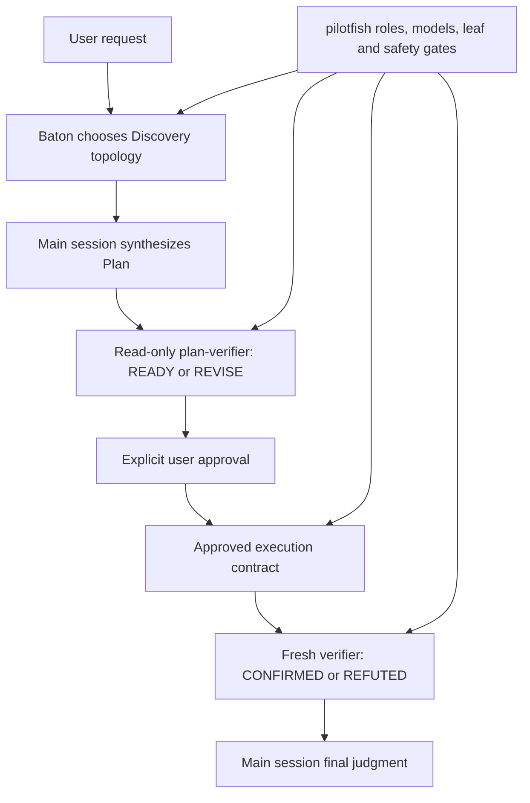

# pilotfish + Baton compatibility gate

## Contents

- [Purpose](#purpose)
- [Composition contract](#composition-contract)
- [Isolation and reproduction](#isolation-and-reproduction)
- [Exact prompts](#exact-prompts)
- [Recorded v1.3.2 Opus 5 lifecycle](#recorded-v132-opus-5-lifecycle)
- [Recorded v1.3.2 sliced lifecycle](#recorded-v132-sliced-lifecycle)
- [Recorded v1.3.1 approval-lifecycle result](#recorded-v131-approval-lifecycle-result)
- [Superseded, failed, and rejected harness runs](#superseded-failed-and-rejected-harness-runs)
- [Limits and disclosure](#limits-and-disclosure)

## Purpose

This benchmark records compatibility and provenance Gates for [Baton](https://github.com/cablate/baton) under native first-party Claude routing. The additive v1.3.2 run exercises one program envelope and only its next executable slice; the historical `final_gate` preserves the earlier v1.3.1 approval lifecycle. Baton owns delegation topology; pilotfish remains authoritative for named roles, role models, leaf-agent boundaries, approval, tool capabilities, and verifier vocabulary.

> **Gate:** Discovery may happen before the implementation outcome is known, but writes wait for a main-session Plan and explicit approval. Plan review returns `READY` / `REVISE`; outcome review returns `CONFIRMED` / `REFUTED`. This Gate is compatibility/provenance only: it does not establish efficiency, latency, cost, or an A/B comparison.

The fixture is the [two-surface research control](../dispatch-brake/positive-controls/research/fixture) first published in pilotfish commit `5f027b8c`. The successful run used base HEAD `4d65cc94b59acec2debec37983ad0a021440d643`, Claude Code 2.1.217, native first-party Claude authentication, Fast mode off, policy SHA `7ff86564…fb21`, and the installed Baton skill whose `SKILL.md` SHA-256 is recorded in [`results.json`](./results.json). The policy revisions were motivated by the [field report](../../docs/field-report-tokscale-2026-07.zh-TW.md), whose observations came from remora sessions routed to GPT-5.6; those observations support backend-neutral guardrails, not native-Claude numeric optimization.

### Design provenance

One direct design input for this five-stage lifecycle came from [CabLate](https://github.com/cablate), author of [Baton](https://github.com/cablate/baton), during a July 13, 2026 discussion about delegation boundaries in large legacy-code refactors. A faithful English translation follows; the [Traditional Chinese report](./README.zh-TW.md#設計緣起) preserves the original wording:

> Large projects have a prerequisite: the scope needs to be defined. In my legacy-code refactoring example, Baton would first dispatch research agents according to my current request and the goal of that phase, so they could understand the project's current state and analyze how to delegate the work that follows.
>
> An ideal flow, then, should look like this:
>
> The user submits a request
>
> -> Baton plans how to delegate agents to understand the request
>
> -> After the agents return with what they found, the main session writes a Plan
>
> (During this process, Baton may still delegate a verification agent to validate the Plan in detail)
>
> -> The user approves execution of the Plan, and Baton executes the best delegation strategy based on that Plan

— [CabLate](https://github.com/cablate), July 13, 2026; translated from the [Traditional Chinese original](./README.zh-TW.md#設計緣起).

That workflow was later formalized as Discovery → Plan → Approval → Execution → Verification and became the backbone of the composition contract below.

## Composition contract



| Layer | Owns | Must not override |
|---|---|---|
| Baton | Questions, topology, worker count, ownership, sequence, budgets, stop conditions | Named-role models, approval, verifier capability, leaf boundary |
| pilotfish | Named roles, role models, tool allowlists, phase gates, approval contract, verifier vocabulary | Baton's topology judgment inside those gates |
| Main session | Evidence reconciliation, Plan synthesis, integration, final judgment | Required approval or independent verification |

## Isolation and reproduction

The test fixture is a disposable Git repository. The exact historical v1.3.1 policy and eight-role session JSON used by this approval-lifecycle run are committed under [`final-gate-snapshot/`](./final-gate-snapshot/); [`build-agents-json.py`](./build-agents-json.py) converts current role files into a separate candidate `--agents` payload. This avoids overwriting installed global pilotfish files, keeps the runtime-tested snapshot auditable, and prevents later template changes from rewriting historical input. User memory still stacked underneath the more-specific project policy and is disclosed as a limit; session-scoped role definitions replaced user role definitions for this run.

> ⚠️ **Safety boundary:** `--dangerously-skip-permissions` was used only in the disposable fixture. Do not reuse it in an untrusted or valuable checkout.

```bash
SOURCE=/path/to/pilotfish-checkout
ROOT="$(mktemp -d /tmp/pilotfish-baton-gate.XXXXXX)"
WORK="$ROOT/fixture"
SNAPSHOT="$SOURCE/benchmarks/baton-compatibility/final-gate-snapshot"

mkdir -p "$WORK"
cp -R "$SOURCE/benchmarks/dispatch-brake/positive-controls/research/fixture/." "$WORK/"
cp "$SNAPSHOT/CLAUDE.md" "$ROOT/CLAUDE.md"
git init -q "$WORK"
git -C "$WORK" add .
git -C "$WORK" -c user.name=pilotfish-gate \
  -c user.email=pilotfish-gate@example.invalid commit -qm baseline

AGENTS_JSON="$(cat "$SNAPSHOT/agents.json")"
SESSION_ID="$(python3 -c 'import uuid; print(uuid.uuid4())')"
cd "$WORK"
```

The user setting source is intentional: Baton was installed under the user skill directory. Excluding `user` makes the Skill tool report `Unknown skill`. The project-level candidate policy is more specific than user memory, and session-scoped `--agents` definitions take precedence over user agent files.

```bash
claude --dangerously-skip-permissions \
  -p --output-format json --max-budget-usd 6 \
  --session-id "$SESSION_ID" --model opus --effort high \
  --setting-sources user,project,local --strict-mcp-config \
  --agents "$AGENTS_JSON" \
  "$(cat "$SOURCE/benchmarks/baton-compatibility/prompts/turn-1.txt")"

claude --dangerously-skip-permissions \
  -p --output-format json --max-budget-usd 6 \
  --resume "$SESSION_ID" --model opus --effort high \
  --setting-sources user,project,local --strict-mcp-config \
  --agents "$AGENTS_JSON" \
  "$(cat "$SOURCE/benchmarks/baton-compatibility/prompts/turn-2.txt")"
```

This fixture exercises the documented runtime composition and exact role definitions. [`final-gate-snapshot/CLAUDE.md`](./final-gate-snapshot/CLAUDE.md) hashes as stored; `agents.json` is read through shell command substitution, which strips its repository trailing newline before hashing and injection. The policy and role definitions match this Gate's historical runtime-tested inputs. Because shell command substitution strips trailing newlines, [`results.json`](./results.json) records both each prompt file's SHA-256 and the normalized runtime-input SHA-256, together with invocation evidence. The Gate does not separately test global file discovery or the installer; those remain covered by the installer review path and policy contract tests.

## Exact prompts

| Turn | Prompt | Required stop |
|---|---|---|
| Discovery + Plan | [`prompts/turn-1.txt`](./prompts/turn-1.txt) | Baton loaded, no writes, read-only `plan-verifier` uses only `READY` / `REVISE`, then wait for approval |
| Approval + execution | [`prompts/turn-2.txt`](./prompts/turn-2.txt) | Only `REPORT.md`, tests pass, fresh outcome verifier returns `CONFIRMED` |

## Recorded v1.3.2 Opus 5 lifecycle

Claude Code 2.1.219 loaded the proposed `model: "opus"` settings, the unchanged
v1.3.2 policy, the current generated eight-role payload, and a project-local
copy of the installed Baton skill. Project-local skill loading deliberately
excluded the user setting source: a rejected attempt and an explicit route
probe both resolved `opus` to Opus 4.8 when that source was present. This
records a source-dependent difference, not a proven cause.

| Invocation | Client duration / summed API time | Cost field / turns | Result |
|---|---:|---:|---|
| Plan | 408.315 / 562.239 s | $2.66763805 / 7 | Two background Haiku scouts completed; ENV and S1 each returned `REVISE` once, then fresh Opus 5 `plan-verifier` calls returned `READY`; no writes |
| Approved S1 | 34.671 / 292.368 s | $1.4412844 / 3 | Sonnet writer hit the disclosed report-file guard; main integrated only `REPORT.md`; `npm test` passed and an Opus 5 verifier returned `CONFIRMED`, but main then changed one clause |
| Corrective final-byte verification | 10.867 / 115.184 s | $1.4398525 / 2 | No writes; `npm test` passed; a new Opus 5 verifier returned `CONFIRMED` for SHA `bcbc74b7…93e1` |
| **Successful lifecycle total** | **453.853 / 969.791 s** | **$5.54877495 / 12** | **Passed after 3 CLI invocations; S2 stayed deferred** |

The client `duration_ms` field excludes some tracked background wait, while its
API field sums overlapping agents; neither column is presented as an
end-to-end wall-time measurement. The original two-CLI shape did **not** pass:
editing after the first outcome verdict broke final-byte coverage, so a third
invocation was required. `results.json` keeps that sequencing defect instead of
collapsing the corrective verifier into Turn 2. The final repository-owned
test, scope check, SHA check, and fresh verifier all covered the same bytes.

The rejected user-source attempt stopped before approval after spending
$1.5908975 on Opus 4.8; its explicit route probe added $0.169445. Together with
the successful lifecycle, the recorded Opus-default validation campaign
reported $7.30911745. These are client cost observations, not an invoice or a
comparative performance result. The run did not trigger `fallbackModel`,
security routing, or Fable.

## Recorded v1.3.2 sliced lifecycle

Claude Code 2.1.218 ran the exact
[`v1.3.2-gate-snapshot`](./v1.3.2-gate-snapshot/) with the versioned
[Turn 1](./prompts/v1.3.2-turn-1.txt) and
[Turn 2](./prompts/v1.3.2-turn-2.txt) prompts.

| Turn | Wall / API time | Cost field / turns | Result |
|---|---:|---:|---|
| Plan | 273.977 / 273.017 s | $1.49627725 / 15 | Baton loaded; `ENV-report-audit` then `S1-report` reached foreground Opus `READY`; no write |
| Approved S1 | 171.033 / 170.399 s | $1.2808205 / 4 | Only `REPORT.md`; `npm test` and an independent final-byte rerun passed; fresh Opus verifier returned `CONFIRMED` |
| **Total** | **445.010 / 443.416 s** | **$2.77709775 / 19** | `S2-followup` remained deferred |

`results.json#v1_3_2_release_gate` binds the snapshot, shell-normalized
payload, prompts, transcript, fixture baseline, and final report by SHA-256.
This single run establishes only the exact sliced lifecycle it exercised; it
does not establish cost, latency, quality, or activation frequency.

## Recorded v1.3.1 approval-lifecycle result

`results.json` records `final_gate_status` as `complete` and the v1.3.1 approval-lifecycle `final_gate` as a passed invocation-granularity record. The successful run used base HEAD `4d65cc94b59acec2debec37983ad0a021440d643`, Claude Code 2.1.217, native first-party authentication, explicit `--model opus`, and Fast mode off.

| Turn | Prompt file SHA-256 | Wall time | API time | Client-reported cost | API turns | Result |
|---|---|---:|---:|---:|---:|---|
| Turn 1: Discovery + Plan | `45dbe7b6…fcca7` | 168.410 s | 165.928 s | $1.104294 | 8 | Baton loaded; direct main-session read; zero writes; `READY` |
| Turn 2: approved execution + verification | `82d83309…1918e7` | 278.340 s | 275.037 s | $1.7779397 | 5 | `REPORT.md` only; `npm test` passed; `CONFIRMED` |
| **Total** | | **446.750 s** | **440.965 s** | **$2.8822337** | **13** | Passed across exactly 2 CLI invocations |

Turn 1 loaded Baton, which selected direct main-session discovery because splitting this small fixture had no positive net benefit. The disposable repository stayed clean with no writes before approval. The read-only `plan-verifier` omitted invocation-level `model`, observed Opus 4.8, and returned `READY` on the first Plan. Turn 2 invoked one foreground `mech-executor` with observed Sonnet 5 and then one fresh `verifier` with observed Opus 4.8; both named calls omitted invocation-level `model`.

An existing hook rejected the worker's direct `Write` and instructed it to return findings as text. The worker returned the complete report content, and the main session integrated it into `REPORT.md` without changing scope. The only fixture change was untracked `REPORT.md`, `npm test` passed, and the outcome verdict was `CONFIRMED`. The verifier disclosed one non-blocking wording issue: `architecture.md:72-78` includes two non-role rows, so describing the whole range as a per-role tier table is broader than the source. The fixture was not modified after `CONFIRMED`.

| Runtime provenance | Value |
|---|---|
| Policy and snapshot SHA-256 | `7ff86564cd4cd8469cf3d24646fd395c57be09dc1fc7e1efa9d0d77c61ecfb21` |
| Shell-stripped historical `agents.json` SHA-256 | `e901e16abdca03ea5f55e3d86f8726fcfa984488305e304c7a382426cd6b7c61` |
| Current generated release payload SHA-256 | `0b42c137daf4006a9c85b201c9434e13640fce69fb10fcf0fba6ba2b1379723c` (post-[#18](https://github.com/Nanako0129/pilotfish/issues/18); recorded separately from this Gate) |
| Turn 1 prompt file SHA-256 | `45dbe7b6b24cb5838ebf4219011797b61f172fcc18f0ca5039144017e93fcca7` |
| Turn 1 runtime-input SHA-256 | `d2ad46b7ecfb503f8f7185d6d68f404d326f1a4a480b9141d1a80318a746bb73` |
| Turn 2 prompt file SHA-256 | `82d833090ba91982651de9ac4beed8fc96311119c6eb9c6f0304c292821918e7` |
| Turn 2 runtime-input SHA-256 | `93ae95d1cd4eebca91ab42a06d484e180f46dd1f327e471a5a4fd2a27ca2f344` |
| Final transcript SHA-256 | `6563b1c5f3d15f2640688a8509fa093364c5534f9246e0ee700e67c3469ac0b5` |

This Gate is compatibility/provenance only. It makes no Fable coverage claim and establishes no native-Claude efficiency result. The field observations that motivated the policy came from remora sessions routed to GPT-5.6 and support backend-neutral anti-churn guardrails; they do not establish native-Claude thresholds, efficiency gains, or an A/B result.

## Superseded, failed, and rejected harness runs

The previous v1.3.0 final Gate remains under `previous_final_gate` in [`results.json`](./results.json), including its two invocation records, role calls, metrics, and transcript hash. Its exact snapshot is recoverable from commit `4d65cc94b59acec2debec37983ad0a021440d643`; it is historical evidence distinct from the recorded v1.3.1 approval-lifecycle Gate.

The first attempt in that compatibility cycle is retained as `failed_candidate_gate` in [`results.json`](./results.json), not silently discarded or relabeled as rejected. It used the old Turn 1 prompt and terminated at the client budget with `budget_exhausted` after 218.040 seconds, 13 API turns, and $4.12912975. Baton loaded, the tree stayed clean, and the read-only `plan-verifier` returned `READY`, but the old prompt did not require the approved turn to invoke the closing outcome verifier. The failure therefore records both budget exhaustion and acceptance-contract ambiguity; the prompt was corrected before the successful run.

| Failed attempt evidence | Value |
|---|---|
| Turn 1 prompt file SHA-256 | `edce6a591e5879769b89b0fff0f4aa8c64e038f79b93e6a804161e4f9914624f` |
| Turn 1 runtime-input SHA-256 | `8aa4459acbb2f96df4617dcbf2b147c91222252a48c8fac754f344bc2d32d2fb` |
| Transcript SHA-256 | `250b8cd8b53e758299b233d16c2753890a46c6284a99a8d21ba5d5e907bf7ebc` |
| Wall time / API time | 218.040 s / 186.738 s |
| Client-reported cost / API turns | $4.12912975 / 13 |
| Terminal disposition | `budget_exhausted`; no write; `READY` without closing outcome verifier |

The 2026-07-20 v1.3.0 candidate at commit `40f3815` is retained as `superseded_candidate_gate` in [`results.json`](./results.json). It passed its lifecycle at the time, but its policy bytes were replaced before the recorded v1.3.1 approval-lifecycle Gate and it is not that cycle's selected final evidence. Its three additive CLI invocation records preserve the observed interruption:

| CLI invocation | Logical prompt | Wall time | Client-reported cost | API turns | Disposition |
|---:|---|---:|---:|---:|---|
| 1 | Turn 1: Discovery + Plan | 159.032 s | $1.8466575 | 18 | Completed; `READY` |
| 2 | Turn 2: approved execution | 46.941 s | $1.081003 | 2 | Interrupted after `REPORT.md` by subscription model limit |
| 3 | Turn 2 resumed | 85.021 s | $1.67602825 | 3 | Completed; `npm test` passed and `CONFIRMED` |
| **Total** | | **290.994 s** | **$4.60368875** | **23** | Superseded candidate, not that cycle's selected final evidence |

The old candidate used direct main-session discovery, a read-only `plan-verifier` that returned `READY` on the first Plan, main-session writing of only `REPORT.md`, and a fresh outcome verifier returning `CONFIRMED`. Turn 2 resumed with the same session ID and verbatim prompt after usage credits were enabled. The interruption, all three invocation metrics, and the old candidate hashes are preserved in [`results.json`](./results.json); none are final-gate metrics for the current policy.

An earlier complete Gate used one dual-mode `verifier` for both Plan and outcome review. It passed at the time (494.933 s, $3.906375, 12 turns), but Codex review found that its Plan and pre-approval security boundaries were prompt-only. It is retained as summary-only `superseded_gate`; its exact inputs remain in [`gate-snapshot/`](./gate-snapshot/).

The v1.2.1 release Gate (368.395 s, $3.710435, 17 turns) is preserved as summary-only `previous_release_gate` in [`results.json`](./results.json) and remains reproducible from Git commit `80b5d1f`. The v1.2.0 release Gate (448.148 s, $3.789048, 22 turns) is restored as summary-only `historical_release_gate` from Git commit `1251465`; no invocation detail is invented.

The first isolation attempt was not counted as compatibility evidence. It used `--setting-sources project,local`, which hid the user-installed Baton skill. The run did not test the requested composition and no approval turn was started.

| Evidence | Value |
|---|---:|
| Wall time | 213.558 s |
| Client-reported cost | $1.627875 |
| API turns | 17 |
| Git state | Clean |
| Disposition | Rejected before Turn 2 |
| Raw transcript SHA-256 | `64376ea52a4e67192df29d8595c180ddc5017638029759a8ac13aff87d5cca81` |

This rejection is published because a behavioral pass is not enough when the dependency under test never loaded.


## Limits and disclosure

> **Do not generalize one compatibility run into a universal performance claim.** The recorded v1.3.1 approval-lifecycle Gate establishes one valid lifecycle and exact-byte provenance for its historical bytes, not an efficiency experiment.

| Limit | Consequence |
|---|---|
| Single successful native run | Timing and cost are observations, not population estimates or a provider invoice |
| Remora/GPT-5.6 field provenance | The field report supports backend-neutral failure-mode guardrails, not native-Claude numeric thresholds or efficiency A/B conclusions |
| Client-reported cost field | It is not a provider invoice; the failed and superseded candidate costs remain historical observations |
| Small fixture | Baton kept discovery in the main session and selected one foreground mechanical writer; larger tasks may choose a different topology |
| Dynamic role injection | Exact policy, role, and prompt bytes were tested, but global agent-file discovery remains outside this compatibility fixture |
| Runtime background result collection | The recorded v1.3.1 approval-lifecycle Gate did not fan out discovery; the preserved v1.3.0 `previous_final_gate` exercised collection from two background scouts |
| Unexercised security / long-process paths | Tool allowlists, policy tests, and dedicated contributor trials cover their contracts; this fixture does not claim runtime coverage |
| Candidate project memory stacked over user memory | The more specific candidate policy governed the fixture; managed policy or contradictory project instructions can still change behavior |
| Single Claude Code 2.1.217 target | Other Claude Code versions need their own smoke test |
| Failed candidate prompt ambiguity | The failed attempt is retained with its old prompt hash and budget exhaustion; the corrected prompt was used for the successful Gate |
| Verifier wording note | `architecture.md:72-78` includes two non-role rows, so describing the full range as a per-role tier table is broad; no fixture change was made after `CONFIRMED` |
| Fable unavailable in this session | The Gate used explicit Opus and makes no Fable coverage or efficiency claim |
| Raw transcript not committed | It contains absolute local paths and session metadata; prompts, normalized calls, content hashes, metrics, and verdicts are published instead |
| Post-Gate role frontmatter change ([#18](https://github.com/Nanako0129/pilotfish/issues/18)) | `executor`'s model changed from Opus to Sonnet after this Gate ran. The committed historical `agents.json` remains byte-identical to the actual runtime input; the current generated release payload and its hash are recorded separately. This Gate's turns never dispatched `executor`, so the transcript, costs, and verdicts above remain accurate for the roles they exercised. Later live replays accepted the changed payload but dispatched `mech-executor` or `scout`, not the changed `executor`; that role still lacks a dedicated live Gate. See `results.json`'s `post_gate_role_frontmatter_change` |
