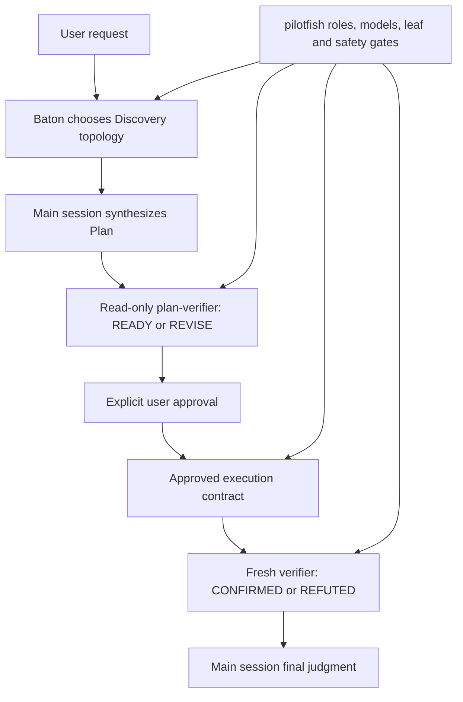

# pilotfish + Baton compatibility gate

## Contents

- [Purpose](#purpose)
- [Composition contract](#composition-contract)
- [Isolation and reproduction](#isolation-and-reproduction)
- [Exact prompts](#exact-prompts)
- [Final gate result](#final-gate-result)
- [Superseded and rejected harness runs](#superseded-and-rejected-harness-runs)
- [Limits and disclosure](#limits-and-disclosure)

## Purpose

This experiment tests whether [Baton](https://github.com/cablate/baton) and the pilotfish v1.2.1 release candidate can complete a real plan-first lifecycle under native Claude routing. Baton owns the smallest useful delegation topology; pilotfish remains authoritative for named roles, role models, leaf-agent boundaries, approval, tool capabilities, and verifier vocabulary. The committed snapshot and release templates are the exact bytes tested at runtime.

> **Gate:** Discovery may happen before the implementation outcome is known, but writes wait for a main-session Plan and explicit approval. Plan review returns `READY` / `REVISE`; outcome review returns `CONFIRMED` / `REFUTED`.

The fixture is the [two-surface research control](../dispatch-brake/positive-controls/research/fixture) first published in pilotfish commit `5f027b8c`. The run used Claude Code 2.1.211, native first-party Claude authentication, the PR #14 maintainer-corrected candidate policy, and the installed Baton skill whose `SKILL.md` SHA-256 is recorded in [`results.json`](./results.json).

### Design provenance

One direct design input for this five-stage lifecycle came from [CabLate](https://github.com/cablate), author of [Baton](https://github.com/cablate/baton), during a July 13, 2026 discussion about delegation boundaries in large legacy-code refactors. A faithful English translation follows; the [Traditional Chinese report](./README.zh-TW.md#設計緣起) preserves the original wording:

> Large projects have a prerequisite: the scope needs to be defined. In my legacy-code refactoring example, Baton would first dispatch research agents according to my current request and the goal of that phase, so they could understand the project's current state and analyze how to delegate the work that follows.
>
> An ideal flow, then, should look like this:
>
> The user submits a request
>
> -> Baton plans how to delegate agents to understand the request
>
> -> After the agents return with what they found, the main session writes a Plan
>
> (During this process, Baton may still delegate a verification agent to validate the Plan in detail)
>
> -> The user approves execution of the Plan, and Baton executes the best delegation strategy based on that Plan

— [CabLate](https://github.com/cablate), July 13, 2026; translated from the [Traditional Chinese original](./README.zh-TW.md#設計緣起).

That workflow was later formalized as Discovery → Plan → Approval → Execution → Verification and became the backbone of the composition contract below.

## Composition contract



| Layer | Owns | Must not override |
|---|---|---|
| Baton | Questions, topology, worker count, ownership, sequence, budgets, stop conditions | Named-role models, approval, verifier capability, leaf boundary |
| pilotfish | Named roles, role models, tool allowlists, phase gates, approval contract, verifier vocabulary | Baton's topology judgment inside those gates |
| Main session | Evidence reconciliation, Plan synthesis, integration, final judgment | Required approval or independent verification |

## Isolation and reproduction

The test ran in a disposable Git repository. The exact final policy and eight-role session JSON are committed under [`final-gate-snapshot/`](./final-gate-snapshot/); [`build-agents-json.py`](./build-agents-json.py) converts the candidate role files to the injected `--agents` payload. This avoids overwriting the installed global pilotfish files and makes the tested working-tree snapshot auditable. User memory still stacks underneath the more-specific project candidate and is disclosed as a limit; session-scoped role definitions replace user role definitions for this run.

> ⚠️ **Safety boundary:** `--dangerously-skip-permissions` was used only in the disposable fixture. Do not reuse it in an untrusted or valuable checkout.

```bash
SOURCE=/path/to/pilotfish-pr14
ROOT="$(mktemp -d /tmp/pilotfish-baton-gate.XXXXXX)"
WORK="$ROOT/fixture"
SNAPSHOT="$SOURCE/benchmarks/baton-compatibility/final-gate-snapshot"

mkdir -p "$WORK"
cp -R "$SOURCE/benchmarks/dispatch-brake/positive-controls/research/fixture/." "$WORK/"
cp "$SNAPSHOT/CLAUDE.md" "$ROOT/CLAUDE.md"
git init -q "$WORK"
git -C "$WORK" add .
git -C "$WORK" -c user.name=pilotfish-gate \
  -c user.email=pilotfish-gate@example.invalid commit -qm baseline

AGENTS_JSON="$(cat "$SNAPSHOT/agents.json")"
SESSION_ID="$(python3 -c 'import uuid; print(uuid.uuid4())')"
cd "$WORK"
```

The user setting source is intentional: Baton was installed under the user skill directory. Excluding `user` makes the Skill tool report `Unknown skill`. The project-level candidate policy is more specific than user memory, and session-scoped `--agents` definitions take precedence over user agent files.

```bash
claude --dangerously-skip-permissions \
  -p --output-format json --max-budget-usd 3 \
  --session-id "$SESSION_ID" --model best --effort high \
  --setting-sources user,project,local --strict-mcp-config \
  --agents "$AGENTS_JSON" \
  "$(cat "$SOURCE/benchmarks/baton-compatibility/prompts/turn-1.txt")"

claude --dangerously-skip-permissions \
  -p --output-format json --max-budget-usd 3 \
  --resume "$SESSION_ID" --model best --effort high \
  --setting-sources user,project,local --strict-mcp-config \
  --agents "$AGENTS_JSON" \
  "$(cat "$SOURCE/benchmarks/baton-compatibility/prompts/turn-2.txt")"
```

This gate exercises runtime policy composition and the exact final role definitions. [`final-gate-snapshot/CLAUDE.md`](./final-gate-snapshot/CLAUDE.md) hashes as stored; `agents.json` is read through shell command substitution, which strips its repository trailing newline before hashing and injection. Both the policy and role definitions match the current release templates exactly. [`results.json`](./results.json) records their hashes, and tests require byte-for-byte policy equality. The Gate does not separately test global file discovery or the installer; those remain covered by the installer review path and policy contract tests.

## Exact prompts

| Turn | Prompt | Required stop |
|---|---|---|
| Discovery + Plan | [`prompts/turn-1.txt`](./prompts/turn-1.txt) | Baton loaded, no writes, read-only `plan-verifier` uses only `READY` / `REVISE`, then wait for approval |
| Approval + execution | [`prompts/turn-2.txt`](./prompts/turn-2.txt) | Only `REPORT.md`, tests pass, fresh outcome verifier returns `CONFIRMED` |

## Final gate result

| Turn | Wall time | Client-reported cost | API turns | Models | Result |
|---|---:|---:|---:|---|---|
| Discovery + Plan | 247.719 s | $1.992795 | 13 | Fable 5 + Opus 4.8 | Baton loaded; direct discovery; Git clean; read-only `plan-verifier` returned `REVISE`; main corrected six citation ranges before approval |
| Approved execution + verification | 120.676 s | $1.717640 | 4 | Fable 5 + Opus 4.8 | Main session wrote only `REPORT.md`; `npm test` passed; outcome `verifier` returned `CONFIRMED` |
| Total | 368.395 s | $3.710435 | 17 | Fable 5 + Opus 4.8 | Complete lifecycle passed without resend |

Baton chose direct main-session discovery. The readiness verifier caught six incorrect line ranges in the draft Plan, so the main session corrected those citations before requesting approval. Because all evidence already remained in the main context, Baton also kept the approved one-file synthesis in the main session; it then delegated only fresh outcome verification. This run therefore demonstrates that Baton can choose direct work at either phase when dispatch would add no net value.

| Agent call | Scheduling | Invocation `model` | Observed model | Verdict |
|---|---|---|---|---|
| `plan-verifier`: Plan readiness | Foreground | Omitted | `claude-opus-4-8` | `REVISE`; observed tools only `Glob` / `Read` |
| `verifier`: outcome verification | Foreground | Omitted | `claude-opus-4-8` | `CONFIRMED` |

| Acceptance check | Result |
|---|---|
| Baton availability | Skill tool returned `Launching skill: baton-dispatch` |
| Writes before approval | None; Turn 1 ended with a clean Git tree |
| Plan ownership | Main session |
| Plan revision | `plan-verifier` returned `REVISE`; main corrected all six Surface B model citations from lines 5–6 to lines 4–5 before approval |
| Write scope | `REPORT.md` only; 44 lines, 4,540 bytes |
| Citation verification | 30 surface citations checked by the outcome verifier |
| Repository test | `REPORT.md covers both independent surfaces with file:line evidence` |
| Verifier vocabulary | Plan `REVISE`; outcome `CONFIRMED`; no cross-mode labels |
| Named-role routing | Both Agent calls omitted invocation-level `model`; Plan and outcome verification used Opus 4.8 |
| Startup resend | Not required; both turns created and grew their transcripts normally |

Machine-readable data is in [`results.json`](./results.json). The final raw transcript SHA-256 is `1beba30b94ec6ee6f74fa96cb880c8a8ecabbdf335a7c3542fda0c99521575a3`.

The Gate did not trigger background recon result collection, a long-running process, or `security-reviewer`. The result-collection versus continuation distinction added in v1.2.1 is locked by a deterministic contract test, but this run makes no live-runtime claim for that path. Long-process behavior retains [@dromsak's four direct harness trials](https://github.com/Nanako0129/pilotfish/pull/10#issuecomment-4958570683) plus four-role contract tests; the security-reviewer boundary is verified by its positive tool allowlist and policy tests. No extra edge-case Claude run is presented as evidence.

## Superseded and rejected harness runs

An earlier complete Gate used one dual-mode `verifier` for both Plan and outcome review. It passed at the time (494.933 s, $3.906375, 12 turns), but Codex review found that its Plan and pre-approval security boundaries were prompt-only. It is now superseded by the capability-separated run above; its exact inputs remain in [`gate-snapshot/`](./gate-snapshot/) and its transcript hash remains in [`results.json`](./results.json).

The v1.2.0 release Gate (448.148 s, $3.789048, 22 turns) remains reproducible from Git commit `1251465`; [`results.json`](./results.json) preserves its source commit, hashes, metrics, and transcript hash instead of rewriting that historical evidence in place.

The first isolation attempt was not counted as compatibility evidence. It used `--setting-sources project,local`, which hid the user-installed Baton skill. The remaining pilotfish gates still reached a clean `READY`, but the run did not test the requested composition and no approval turn was started.

| Evidence | Value |
|---|---:|
| Wall time | 213.558 s |
| Client-reported cost | $1.627875 |
| API turns | 17 |
| Git state | Clean |
| Disposition | Rejected before Turn 2 |
| Raw transcript SHA-256 | `64376ea52a4e67192df29d8595c180ddc5017638029759a8ac13aff87d5cca81` |

This rejection is published because a behavioral pass is not enough when the dependency under test never loaded.

## Limits and disclosure

> **Do not generalize one passing run into a universal performance claim.** The gate establishes one valid lifecycle and routing trace, not an expected topology, latency, or cost.

| Limit | Consequence |
|---|---|
| Single final run | Timing and cost are observations, not population estimates |
| Client-reported cost field | It is not a provider invoice |
| Small fixture | Baton chose direct discovery and direct main-session writing; larger tasks may choose bounded fan-out or delegated writing |
| Dynamic role injection | Exact final snapshot definitions were tested, but global agent-file discovery was outside this runtime Gate |
| Unexercised background result collection | A deterministic policy test covers the collection/continuation contract; this fixture did not trigger background recon retrieval |
| Unexercised security / long-process paths | Tool allowlists, policy tests, and dedicated contributor trials cover their contracts; this fixture does not claim runtime coverage |
| Candidate project memory stacked over user memory | The more specific candidate policy governed the fixture; managed policy or contradictory project instructions can still change behavior |
| Single Claude Code 2.1.211 runtime | The provider route was native first-party Claude; other Claude Code versions need their own smoke test |
| Raw transcript not committed | It contains absolute local paths and session metadata; prompts, normalized calls, content hashes, metrics, and verdicts are published instead |
