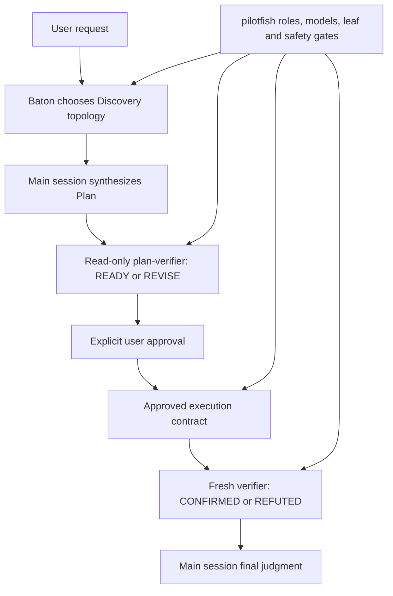

# pilotfish + Baton compatibility gate

## Contents

- [Purpose](#purpose)
- [Composition contract](#composition-contract)
- [Isolation and reproduction](#isolation-and-reproduction)
- [Exact prompts](#exact-prompts)
- [Current final gate result](#current-final-gate-result)
- [Superseded, failed, and rejected harness runs](#superseded-failed-and-rejected-harness-runs)
- [Limits and disclosure](#limits-and-disclosure)

## Purpose

This benchmark is a compatibility and provenance gate for [Baton](https://github.com/cablate/baton) and the pilotfish v1.3.0 release snapshot under native first-party Claude routing. The fresh `final_gate` completed successfully on Claude Code 2.1.215 with Fast mode off. Baton owns delegation topology; pilotfish remains authoritative for named roles, role models, leaf-agent boundaries, approval, tool capabilities, and verifier vocabulary. The committed snapshot and release templates are the exact runtime-tested bytes.

> **Gate:** Discovery may happen before the implementation outcome is known, but writes wait for a main-session Plan and explicit approval. Plan review returns `READY` / `REVISE`; outcome review returns `CONFIRMED` / `REFUTED`. This Gate is compatibility/provenance only: it does not establish efficiency, latency, cost, or an A/B comparison.

The fixture is the [two-surface research control](../dispatch-brake/positive-controls/research/fixture) first published in pilotfish commit `5f027b8c`. The successful run used base HEAD `a38dd2dde000441b24881fa49495e545ff21b9e6`, Claude Code 2.1.215, native first-party Claude authentication, Fast mode off, the current v1.3.0 policy bytes, and the installed Baton skill whose `SKILL.md` SHA-256 is recorded in [`results.json`](./results.json). The policy revisions were motivated by the [field report](../../docs/field-report-tokscale-2026-07.zh-TW.md), whose observations came from remora sessions routed to GPT-5.6; those observations support backend-neutral guardrails, not native-Claude numeric optimization.

### Design provenance

One direct design input for this five-stage lifecycle came from [CabLate](https://github.com/cablate), author of [Baton](https://github.com/cablate/baton), during a July 13, 2026 discussion about delegation boundaries in large legacy-code refactors. A faithful English translation follows; the [Traditional Chinese report](./README.zh-TW.md#設計緣起) preserves the original wording:

> Large projects have a prerequisite: the scope needs to be defined. In my legacy-code refactoring example, Baton would first dispatch research agents according to my current request and the goal of that phase, so they could understand the project's current state and analyze how to delegate the work that follows.
>
> An ideal flow, then, should look like this:
>
> The user submits a request
>
> -> Baton plans how to delegate agents to understand the request
>
> -> After the agents return with what they found, the main session writes a Plan
>
> (During this process, Baton may still delegate a verification agent to validate the Plan in detail)
>
> -> The user approves execution of the Plan, and Baton executes the best delegation strategy based on that Plan

— [CabLate](https://github.com/cablate), July 13, 2026; translated from the [Traditional Chinese original](./README.zh-TW.md#設計緣起).

That workflow was later formalized as Discovery → Plan → Approval → Execution → Verification and became the backbone of the composition contract below.

## Composition contract



| Layer | Owns | Must not override |
|---|---|---|
| Baton | Questions, topology, worker count, ownership, sequence, budgets, stop conditions | Named-role models, approval, verifier capability, leaf boundary |
| pilotfish | Named roles, role models, tool allowlists, phase gates, approval contract, verifier vocabulary | Baton's topology judgment inside those gates |
| Main session | Evidence reconciliation, Plan synthesis, integration, final judgment | Required approval or independent verification |

## Isolation and reproduction

The test fixture is a disposable Git repository. The exact current v1.3.0 policy and eight-role session JSON are committed under [`final-gate-snapshot/`](./final-gate-snapshot/); [`build-agents-json.py`](./build-agents-json.py) converts the candidate role files to the injected `--agents` payload. This avoids overwriting the installed global pilotfish files and makes the runtime-tested working-tree snapshot auditable. User memory still stacks underneath the more-specific project candidate and is disclosed as a limit; session-scoped role definitions replaced user role definitions for this run.

> ⚠️ **Safety boundary:** `--dangerously-skip-permissions` was used only in the disposable fixture. Do not reuse it in an untrusted or valuable checkout.

```bash
SOURCE=/path/to/pilotfish-checkout
ROOT="$(mktemp -d /tmp/pilotfish-baton-gate.XXXXXX)"
WORK="$ROOT/fixture"
SNAPSHOT="$SOURCE/benchmarks/baton-compatibility/final-gate-snapshot"

mkdir -p "$WORK"
cp -R "$SOURCE/benchmarks/dispatch-brake/positive-controls/research/fixture/." "$WORK/"
cp "$SNAPSHOT/CLAUDE.md" "$ROOT/CLAUDE.md"
git init -q "$WORK"
git -C "$WORK" add .
git -C "$WORK" -c user.name=pilotfish-gate \
  -c user.email=pilotfish-gate@example.invalid commit -qm baseline

AGENTS_JSON="$(cat "$SNAPSHOT/agents.json")"
SESSION_ID="$(python3 -c 'import uuid; print(uuid.uuid4())')"
cd "$WORK"
```

The user setting source is intentional: Baton was installed under the user skill directory. Excluding `user` makes the Skill tool report `Unknown skill`. The project-level candidate policy is more specific than user memory, and session-scoped `--agents` definitions take precedence over user agent files.

```bash
claude --dangerously-skip-permissions \
  -p --output-format json --max-budget-usd 6 \
  --session-id "$SESSION_ID" --model best --effort high \
  --setting-sources user,project,local --strict-mcp-config \
  --agents "$AGENTS_JSON" \
  "$(cat "$SOURCE/benchmarks/baton-compatibility/prompts/turn-1.txt")"

claude --dangerously-skip-permissions \
  -p --output-format json --max-budget-usd 6 \
  --resume "$SESSION_ID" --model best --effort high \
  --setting-sources user,project,local --strict-mcp-config \
  --agents "$AGENTS_JSON" \
  "$(cat "$SOURCE/benchmarks/baton-compatibility/prompts/turn-2.txt")"
```

This fixture exercises the documented runtime composition and exact role definitions. [`final-gate-snapshot/CLAUDE.md`](./final-gate-snapshot/CLAUDE.md) hashes as stored; `agents.json` is read through shell command substitution, which strips its repository trailing newline before hashing and injection. The policy and role definitions match the runtime-tested release inputs. Because shell command substitution strips trailing newlines, [`results.json`](./results.json) records both each prompt file's SHA-256 and the normalized runtime-input SHA-256, together with invocation evidence. The Gate does not separately test global file discovery or the installer; those remain covered by the installer review path and policy contract tests.

## Exact prompts

| Turn | Prompt | Required stop |
|---|---|---|
| Discovery + Plan | [`prompts/turn-1.txt`](./prompts/turn-1.txt) | Baton loaded, no writes, read-only `plan-verifier` uses only `READY` / `REVISE`, then wait for approval |
| Approval + execution | [`prompts/turn-2.txt`](./prompts/turn-2.txt) | Only `REPORT.md`, tests pass, fresh outcome verifier returns `CONFIRMED` |

## Current final gate result

`results.json` records `final_gate_status` as `complete` and the current v1.3.0 `final_gate` as a passed invocation-granularity record. The successful run used base HEAD `a38dd2dde000441b24881fa49495e545ff21b9e6`, Claude Code 2.1.215, native first-party authentication, and Fast mode off.

| Turn | Prompt file SHA-256 | Wall time | API time | Client-reported cost | API turns | Result |
|---|---|---:|---:|---:|---:|---|
| Turn 1: Discovery + Plan | `45dbe7b6…fcca7` | 151.241 s | 286.044 s | $2.07174695 | 2 | Baton loaded; two background scouts; zero writes; `READY` |
| Turn 2: approved execution + verification | `82d83309…1918e7` | 172.737 s | 172.012 s | $1.43709855 | 4 | `REPORT.md` only; `npm test` passed; `CONFIRMED` |
| **Total** | | **323.978 s** | **458.056 s** | **$3.5088455** | **6** | Passed across 2 CLI invocations |

Turn 1 used two parallel background scouts. The disposable repository stayed clean with no writes before approval. The read-only `plan-verifier` omitted invocation-level `model`, observed Opus 4.8, returned `READY`, and offered one non-blocking citation suggestion that was adopted before the final Plan. Turn 2 used a foreground `mech-executor` with observed Sonnet 5 and `Write` + `Bash`, then a foreground fresh `verifier` with observed Opus 4.8 and `Bash` + `Read`; both named calls omitted invocation-level `model`. The only fixture change was untracked `REPORT.md`, `npm test` passed, and the outcome verdict was `CONFIRMED`. Background scout collection was exercised at runtime.

The verifier noted one non-blocking citation detail: `architecture.md:63` is a blank line, while `architecture.md:62` fully supports the claim. The fixture was not modified after `CONFIRMED`; the note is disclosed in [`results.json`](./results.json).

| Runtime provenance | Value |
|---|---|
| Policy and snapshot SHA-256 | `d41a9d41db21e97176e82614dcfd4d80cba670ec28136666cc96906dd5efda35` |
| Shell-stripped `agents.json` SHA-256 | `27b6f6df289715f302a1022b428c62ddf7a7dadb2e0cae4f9eb4197c5bd916de` (regenerated post-[#18](https://github.com/Nanako0129/pilotfish/issues/18); was `e901e16abdca03ea5f55e3d86f8726fcfa984488305e304c7a382426cd6b7c61` when this Gate ran) |
| Turn 1 prompt file SHA-256 | `45dbe7b6b24cb5838ebf4219011797b61f172fcc18f0ca5039144017e93fcca7` |
| Turn 1 runtime-input SHA-256 | `d2ad46b7ecfb503f8f7185d6d68f404d326f1a4a480b9141d1a80318a746bb73` |
| Turn 2 prompt file SHA-256 | `82d833090ba91982651de9ac4beed8fc96311119c6eb9c6f0304c292821918e7` |
| Turn 2 runtime-input SHA-256 | `93ae95d1cd4eebca91ab42a06d484e180f46dd1f327e471a5a4fd2a27ca2f344` |
| Final transcript SHA-256 | `98724de501d714dcb58b315b2260147f9cdd43975f16e52297a84ed258a83ac4` |

This Gate is compatibility/provenance only. The field observations that motivated the policy came from remora sessions routed to GPT-5.6 and support backend-neutral anti-churn guardrails; they do not establish native-Claude thresholds, efficiency gains, or an A/B result.

## Superseded, failed, and rejected harness runs

The first attempt against the current policy bytes is retained as `failed_candidate_gate` in [`results.json`](./results.json), not silently discarded or relabeled as rejected. It used the old Turn 1 prompt and terminated at the client budget with `budget_exhausted` after 218.040 seconds, 13 API turns, and $4.12912975. Baton loaded, the tree stayed clean, and the read-only `plan-verifier` returned `READY`, but the old prompt did not require the approved turn to invoke the closing outcome verifier. The failure therefore records both budget exhaustion and acceptance-contract ambiguity; the prompt was corrected before the successful run.

| Failed attempt evidence | Value |
|---|---|
| Turn 1 prompt file SHA-256 | `edce6a591e5879769b89b0fff0f4aa8c64e038f79b93e6a804161e4f9914624f` |
| Turn 1 runtime-input SHA-256 | `8aa4459acbb2f96df4617dcbf2b147c91222252a48c8fac754f344bc2d32d2fb` |
| Transcript SHA-256 | `250b8cd8b53e758299b233d16c2753890a46c6284a99a8d21ba5d5e907bf7ebc` |
| Wall time / API time | 218.040 s / 186.738 s |
| Client-reported cost / API turns | $4.12912975 / 13 |
| Terminal disposition | `budget_exhausted`; no write; `READY` without closing outcome verifier |

The 2026-07-20 v1.3.0 candidate at commit `40f3815` is retained as `superseded_candidate_gate` in [`results.json`](./results.json). It passed its lifecycle at the time, but its policy bytes were replaced before this fresh Gate and it must not be read as current final evidence. Its three additive CLI invocation records preserve the observed interruption:

| CLI invocation | Logical prompt | Wall time | Client-reported cost | API turns | Disposition |
|---:|---|---:|---:|---:|---|
| 1 | Turn 1: Discovery + Plan | 159.032 s | $1.8466575 | 18 | Completed; `READY` |
| 2 | Turn 2: approved execution | 46.941 s | $1.081003 | 2 | Interrupted after `REPORT.md` by subscription model limit |
| 3 | Turn 2 resumed | 85.021 s | $1.67602825 | 3 | Completed; `npm test` passed and `CONFIRMED` |
| **Total** | | **290.994 s** | **$4.60368875** | **23** | Superseded candidate, not current final |

The old candidate used direct main-session discovery, a read-only `plan-verifier` that returned `READY` on the first Plan, main-session writing of only `REPORT.md`, and a fresh outcome verifier returning `CONFIRMED`. Turn 2 resumed with the same session ID and verbatim prompt after usage credits were enabled. The interruption, all three invocation metrics, and the old candidate hashes are preserved in [`results.json`](./results.json); none are final-gate metrics for the current policy.

An earlier complete Gate used one dual-mode `verifier` for both Plan and outcome review. It passed at the time (494.933 s, $3.906375, 12 turns), but Codex review found that its Plan and pre-approval security boundaries were prompt-only. It is retained as summary-only `superseded_gate`; its exact inputs remain in [`gate-snapshot/`](./gate-snapshot/).

The v1.2.1 release Gate (368.395 s, $3.710435, 17 turns) is preserved as summary-only `previous_release_gate` in [`results.json`](./results.json) and remains reproducible from Git commit `80b5d1f`. The v1.2.0 release Gate (448.148 s, $3.789048, 22 turns) is restored as summary-only `historical_release_gate` from Git commit `1251465`; no invocation detail is invented.

The first isolation attempt was not counted as compatibility evidence. It used `--setting-sources project,local`, which hid the user-installed Baton skill. The run did not test the requested composition and no approval turn was started.

| Evidence | Value |
|---|---:|
| Wall time | 213.558 s |
| Client-reported cost | $1.627875 |
| API turns | 17 |
| Git state | Clean |
| Disposition | Rejected before Turn 2 |
| Raw transcript SHA-256 | `64376ea52a4e67192df29d8595c180ddc5017638029759a8ac13aff87d5cca81` |

This rejection is published because a behavioral pass is not enough when the dependency under test never loaded.


## Limits and disclosure

> **Do not generalize one compatibility run into a universal performance claim.** The fresh Gate establishes one valid lifecycle and exact-byte provenance, not an efficiency experiment.

| Limit | Consequence |
|---|---|
| Single successful native run | Timing and cost are observations, not population estimates or a provider invoice |
| Remora/GPT-5.6 field provenance | The field report supports backend-neutral failure-mode guardrails, not native-Claude numeric thresholds or efficiency A/B conclusions |
| Client-reported cost field | It is not a provider invoice; the failed and superseded candidate costs remain historical observations |
| Small fixture | Baton selected two background scouts and a foreground mechanical executor here; larger tasks may choose a different topology |
| Dynamic role injection | Exact policy, role, and prompt bytes were tested, but global agent-file discovery remains outside this compatibility fixture |
| Runtime background result collection | The successful run exercised collection from two background scouts; other background shapes still need their own evidence |
| Unexercised security / long-process paths | Tool allowlists, policy tests, and dedicated contributor trials cover their contracts; this fixture does not claim runtime coverage |
| Candidate project memory stacked over user memory | The more specific candidate policy governed the fixture; managed policy or contradictory project instructions can still change behavior |
| Single Claude Code 2.1.215 target | Other Claude Code versions need their own smoke test |
| Failed candidate prompt ambiguity | The failed attempt is retained with its old prompt hash and budget exhaustion; the corrected prompt was used for the successful Gate |
| Verifier citation note | `architecture.md:63` is blank while `:62` supports the claim; no fixture change was made after `CONFIRMED` |
| Raw transcript not committed | It contains absolute local paths and session metadata; prompts, normalized calls, content hashes, metrics, and verdicts are published instead |
| Post-Gate role frontmatter change ([#18](https://github.com/Nanako0129/pilotfish/issues/18)) | `executor`'s model changed from Opus to Sonnet after this Gate ran. The committed `agents.json` snapshot was regenerated to stay byte-identical with current templates, which changed its recorded hash. This Gate's turns never dispatched `executor`, so the transcript, costs, and verdicts above remain accurate for the roles they exercised; no live Gate has yet exercised the new Sonnet `executor` specifically. See `results.json`'s `post_gate_role_frontmatter_change` |
