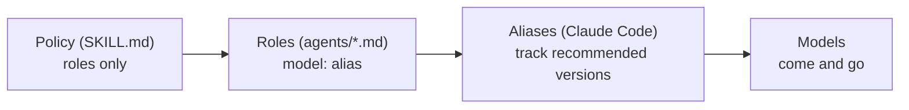

# pilotfish — Design Rationale

## Purpose

This document explains *why* pilotfish is shaped the way it is: a Claude Code plugin that delivers role-based policy, model aliases in role frontmatter, effort tiers, phase-specific approval gates, and fresh verification — with no hook and no runtime dependency of its own, so it runs anywhere Claude Code runs. The empirical grounding (official docs, measured community numbers, subscription economics) lives in the [research report](./research.md); this is the argument from those facts to this design.

## Delivery: a plugin, not a config merge

pilotfish ships as a Claude Code plugin — `/plugin marketplace add Nanako0129/pilotfish`, then `/plugin install pilotfish@pilotfish`, invoked with `/pilotfish:pilotfish`. Plugin skills and agents are namespaced; bare `/pilotfish` is not the installed command. It writes nothing into your `~/.claude/` config or into your projects: installing adds a self-contained bundle, uninstalling removes every trace. Namespacing is precisely *why* the old "shadow the built-in Explore with a same-name agent" trick cannot work here (see [Why no guard](#why-no-guard), below).

Claude Code's plugin manifest has no minimum-runtime field. Because the read-only Plan and security boundaries depend on enforced `tools` allowlists, the skill runs a fail-closed `claude --version` preflight and requires 2.1.207 or newer before delegation or writes.

## The two layers

The core observation is that "who executes what" and "how delegation behaves" change at different rates and should therefore live in different places:

| Layer | File | Changes when | Mechanism |
|---|---|---|---|
| Roles | `agents/*.md` | A model tier is re-pointed | One `model:` line of frontmatter per role |
| Policy | `skills/pilotfish/SKILL.md` | Your working style changes | Prose rules written against role names; loads on `/pilotfish:pilotfish` |

The policy is a **skill**, not a `CLAUDE.md` block, so it loads on demand when you type `/pilotfish:pilotfish` rather than sitting in every session's context. It never names a model — it delegates to role names, and the role frontmatter owns the model bindings. The main-session model stays a user/`settings` concern that pilotfish deliberately does not touch: settings decide *who* orchestrates, the skill decides *how* it delegates. Most of those "how" rules are requests the model can read and, in principle, decline. The three read-only roles are the exception: positive tool allowlists enforce their boundary. Two cross-cutting prohibitions would also benefit from structural enforcement; pilotfish does not ship it, and [Why no guard](#why-no-guard) explains why.

## Role-based policy, model-free prose

The single most important rule in pilotfish: **the policy text never names a model.** It says "delegate mechanical work to `mech-executor`", not "delegate to Sonnet". Model bindings exist in exactly one place — the frontmatter of each agent file.

This is what makes the fallback story degenerate into no-ops:

The June 2026 export-control suspension was a live test of this: accounts on aliases degraded gracefully — a notice banner, new sessions continuing on Opus — while users who had pinned the full `claude-fable-5` model ID got hard 404 errors. That is the resilience story working: every role's alias re-resolves and keeps its binding, and the policy text is already model-agnostic. The July 2026 subscription-to-credits boundary is expected to behave the same way per the documented resolution rule, though Anthropic has not published the exact boundary UX — worst case is one manual `/model` switch or enabling usage credits. The same holds for the next deprecation cycle (Opus 4.8 → 4.9, Sonnet 5 → next): aliases track the recommended version by design.

Three distinct failure modes get three distinct mechanisms — they are often conflated but shouldn't be:

| Failure | Mechanism | Layer |
|---|---|---|
| Lost *access* to the frontier model | `best` alias | settings |
| Model *overloaded / erroring* | `fallbackModel` chain | settings |
| Model *deprecated* | aliases in role frontmatter | agents |

Only the third row is pilotfish's own — the plugin ships the role aliases and nothing else. The first two are user-owned `settings.json` mechanisms pilotfish recommends but does not install (a plugin writes nothing to your config); they protect the main session, which pilotfish leaves to you.

## Why these seven roles

The role set is the smallest one that covers the delegation patterns that actually recur, mapped to the cheapest tier that reliably handles each:

| Role | Tier argument |
|---|---|
| `scout` | Reconnaissance is the highest-volume, lowest-judgment token sink in a coding session (telemetry showed ~36% of calls were exploration even before deliberate routing) — so it is tempting to route to the cheapest tier available. pilotfish deliberately does not. Scout output is *unverified input* to everything downstream: a wrong `file:line` becomes an executor editing the wrong thing, and the verifier gate covers executor work, not recon. Sonnet at low effort is the floor where that stops happening. It also costs less than it appears — on subscriptions Haiku draws on the *scarce* shared all-models bucket, while Sonnet can draw on the dedicated Sonnet-only bucket on top of it. `scout` carries a positive `tools: Read, Glob, Grep` allowlist, so "read-only" is enforced, not just prompted. It is also where recon *must* land: the policy forbids the built-in `Explore` (see [Why no guard](#why-no-guard)) and points callers here instead. |
| `plan-verifier` | Material Plans benefit from fresh-context challenge before approval, but that boundary cannot rely on a prompt-only no-write promise. Its positive `tools: Read, Glob, Grep` allowlist enforces read-only review while Opus supplies the judgment needed to return `READY` or `REVISE`. The main session still owns synthesis and revisions. |
| `security-reviewer` | Pre-approval security evidence needs high-effort judgment and an actually read-only surface. Its positive allowlist permits repository and advisory reads while excluding Bash and write-capable tools. It reports evidence to the main session rather than producing an implementation brief. |
| `mech-executor` | Fully-specified work has its judgment already done — by the orchestrator, in the spec. Sonnet executes specs faithfully at `effort: low`, which is the entire point of keeping this role separate from `executor` (see below). |
| `executor` | Real implementation needs local design judgment — but not frontier reasoning. Sonnet at high effort is the configuration Anthropic itself benchmarked as an orchestrator's worker: 96% of all-frontier performance at 46% of the cost. Routing this to Opus was pilotfish's earlier choice and it was over-insurance: the quality is bought back by the `verifier`, more cheaply and more reliably than by upgrading the executor. |
| `verifier` | Official guidance: independent fresh-context verifiers outperform self-critique. This is the role that makes cheap executors safe, so it is the one place the frontier-adjacent tier is worth paying for — and it is cheaper than it looks, because an executor's cost scales with the *search space* it explores while a verifier's scales only with the *diff* it is handed. It is read-and-run only — a verifier that fixes things stops being independent. |
| `security-executor` | Approved security implementation deserves consistently high effort, and the frontier model's safety classifiers can refuse benign defensive-security work mid-task. Pre-routing approved execution to Opus makes the refusal path unreachable. Pre-approval analysis stays with `security-reviewer`; the capability split prevents a write-capable role from crossing the approval boundary. |

**Why three Sonnet roles instead of one.** `scout`, `mech-executor`, and `executor` all run on Sonnet and differ only in effort and tool access — which looks like role proliferation until you check the `Agent` tool's parameters. It accepts `model`, but there is **no `effort` parameter**: effort can be set *only* in agent frontmatter. So one role definition means exactly one effort level for everything it is ever asked to do, and collapsing them would run a 30-file mechanical rename at `effort: high` — paying frontier-shaped thinking latency for work with no decisions in it. Three files is the only mechanism the harness offers for three effort lanes.

## Why no guard

Two of pilotfish's rules would be better enforced than requested. A `PreToolUse` hook could remove the capability outright rather than ask the model not to use it, and enforcement-by-hook beats enforcement-by-instruction for the same reason a locked door beats a "please don't enter" sign: the model never gets to weigh the rule against the task in front of it. pilotfish ships no such hook. The reason is portability, not a change of mind about the rules.

A hook is a script, and a script needs an interpreter to run it — one Claude Code does not guarantee. Per its own docs, no interpreter is guaranteed present on *any* machine running it: not Python, and not even `node`, since the native/standalone installer never puts `node` on `PATH`. Native Windows is the hard stop: it honors neither a `#!` shebang nor the Unix executable bit, so the idiomatic hook — a script marked executable, invoked bare as `"${CLAUDE_PLUGIN_ROOT}"/scripts/guard.py` — is Unix-only by construction and cannot launch there at all. A plugin that wants to run everywhere Claude Code runs therefore cannot ship an interpreted hook, full stop. pilotfish's answer is to be that plugin: zero runtime dependencies, pure markdown and JSON.

The failure mode is what settles it. A guard hook must fail open — a malformed payload has to allow the call, or a bug in the guard locks you out of your own session. But an interpreter that isn't there also fails open, and *silently*: on exactly the machines where the hook cannot run, you get no enforcement and no signal that enforcement is missing. That is worse than not shipping it, because a rule you believe is enforced is a rule you stop watching. A door that isn't there beats a door you wrongly believe is locked. So enforcement drops back to instruction for the two rules a hook would otherwise hold shut:

- **Long-running processes stay with the orchestrator; a subagent must not detach one.** When a subagent's foreground command exceeds its `timeout`, Claude Code promotes it to a background task — but a promoted process from a foreground-spawned agent is `SIGTERM`ed seconds after the agent returns, destroying the work and truncating its output. `nohup`/`setsid`/`disown`/a trailing `&` dodge that `SIGTERM` by escaping the process group, but they also escape task tracking entirely, so the result is an orphan nobody collects. So subagents must not detach at all; long-running work is handed back to the main session, the only context whose background tasks are both tracked and reliably notified. It is stated as an explicit prohibition in `skills/pilotfish/SKILL.md` and in every role prompt that can run a shell — `scout` is exempt because its `tools` allowlist gives it no `Bash` to detach with, the one rule here that survives as an actual capability removal. `tests/test_plugin.py` pins both halves: that no role is told *to* detach, and that every shell-capable role is told *not* to. Nothing stops a subagent that ignores the prohibition — which is precisely why the prompts must state a rule rather than assert an enforcement that does not exist. A model told the door is locked stops holding it shut.
- **Recon must never land on the built-in `Explore`.** Since Claude Code v2.1.198 the built-in `Explore` inherits the main-session model, so every search it runs from a Fable/Opus session bills at frontier rates — exactly the cost this plugin exists to avoid. v1.x neutralised it by shadowing `Explore` with a same-name *user-level* agent pinned to a cheap tier. **That does not work for a plugin**: plugin agents are namespaced, so `pilotfish:Explore` is a different agent from the built-in and shadows nothing. With shadowing unavailable and a hook unshippable, what remains is the skill's routing table instructing the orchestrator, unconditionally, to use `pilotfish:scout` — the same read-only recon role, pinned to Sonnet at low effort. Be clear-eyed about this one: the cost finding stands, and nothing stops a session that ignores the instruction.

**Where this leaves the two rules.** A hook could have made the `run_in_background` denial airtight — a structural block on a typed boolean parameter, unevadable by phrasing. It could never have done the same for the shell-detach rule, which is regex-over-a-string and beatable by any determined evasion (quoting tricks, a wrapper script, a detaching syscall never spelled `nohup`); that was always best-effort defence against the *accidental* case, not a security boundary. Without a hook, both rules are exactly as strong as the model's willingness to follow an instruction it can read in full. This does not weaken the separate `scout`, `plan-verifier`, and `security-reviewer` boundaries: their positive tool allowlists remove Bash and writes structurally.

## Phase-specific dispatch brakes

Role routing answers *which worker* may receive eligible work; it does not answer *what phase the task is in*. pilotfish therefore gives each phase a different stable contract:

| Phase | Stable before delegation | Main-session responsibility |
|---|---|---|
| Discovery | Question, allowed scope, evidence format, stop condition | Reconcile evidence and decide what it means |
| Plan | Outcome, non-goals, dependencies, ownership, sequence, verification, budgets, stops | Synthesize one Plan and revise it after any readiness review |
| Approval | A material Plan is visible to the user | Wait for explicit approval before gated writes or implementation briefs |
| Execution | Stable scope, exclusive ownership, constraints, done-criteria, integration, verification | Integrate results and resolve architecture forks |
| Verification | The implementation is concrete enough to refute | Make the final judgment after independent evidence returns |

This matters most for exploratory debugging. A single unknown bug often has one tightly coupled reasoning chain from trace to root cause, patch, and live check; handing the middle to a fresh executor makes both sides rebuild context. Keep that chain in the main session. Large cross-surface investigations may still use bounded read-only discovery, but they return to main-session Plan synthesis before any executor starts. Stable multi-file repetition remains the positive delegation path, while material Plans and non-trivial outcomes keep independent verification boundaries.

## Quality: verification over executor pedigree

The intuitive objection to cheap executors is quality. pilotfish's answer is structural, not hopeful:

1. The main session stabilizes evidence and writes complete Plans and one-shot execution specs — most cheap-model failures are actually spec failures.
2. Material Plans may pass through tool-enforced read-only `plan-verifier` before approval; synthesis remains in the main session.
3. Escalation is bounded: two failed attempts on a tier, then escalate or take over. No infinite cheap retries that burn more than they save.
4. Non-trivial work passes through outcome `verifier` — an adversarial, fresh-context pass that tries to *refute* the claimed result before the orchestrator reports it done.

A verifier isn't free — it runs on Opus and re-reads context in a fresh session. It's cheaper than generation only because it reads-and-runs rather than writes-and-iterates, and because the gate is scoped to *non-trivial* work (small changes skip it; the policy says so). What it buys is a change of question: from "is the executor smart enough?" to "did the output survive an independent refutation attempt?" — a much better question. Two known limits, held honestly: same-tier verification catches context-rot and unchecked claims, not capability-ceiling errors (Opus won't know what Opus can't know); and the gate covers executor output, not scout reconnaissance — which is why the policy separately tells the orchestrator to sanity-check load-bearing scouted facts. For security-sensitive diffs, the verifier's own prompt escalates it to a maximum-thoroughness pass.

## Effort tiers

Effort is the second big quota lever after model choice, and the Fable-5 generation shifted the calculus: low effort on current models routinely matches previous-generation `xhigh`. pilotfish therefore pairs every role with an effort:

| Role class | Effort | Why |
|---|---|---|
| Recon (`scout`) | `low` | High volume, near-zero judgment |
| Mechanical (`mech-executor`) | `low` | Judgment lives in the spec |
| Judgment (`executor`, `verifier`) | `high` | `executor` is where Sonnet has to reason, and outcome verification is the gate that makes the cheap tier safe |
| Plan review (`plan-verifier`) | `medium` | Fresh Plan challenge needs judgment without implementation work |
| Security (`security-reviewer`, `security-executor`) | `high` | Correctness over cost at both approval boundaries |
| Main session | `high` (user setting) | Official Fable 5 guidance: `high` for most work, `xhigh` for the longest horizons only |

## Deliberately left out

| Not included | Why |
|---|---|
| Per-project configuration | The six projects audited before building this had zero model policy in their `CLAUDE.md` files — correctly. The plugin is a single source of truth; project files stay pure technical notes. |
| Any hooks at all — both the narrow guard that would enforce the backgrounding/detach and `Explore` rules, and the heavier orchestration-discipline hooks à la fable5-orchestrator's spawn guards and stop guards | An interpreted hook cannot run everywhere Claude Code runs: no interpreter is guaranteed present, and native Windows can't launch a shebang script at all (see [Why no guard](#why-no-guard)). Universal portability is worth more than structural enforcement of two rules, so pilotfish carries zero hooks and those rules live in policy instead. The heavier discipline hooks fail the same test, and are heavy besides: everything they'd buy is better handled by policy plus the verifier gate. |
| `CLAUDE_CODE_SUBAGENT_MODEL` | It overrides every per-agent frontmatter globally, which is precisely the opposite of tiered routing. pilotfish never sets it; if you have it set in your environment, unset it or the role model bindings are ignored. |
| Pinned model IDs | Pinning trades resilience for reproducibility; for a personal global config, resilience wins. Organizations that need pinning have `ANTHROPIC_DEFAULT_*_MODEL`. |
| An `opusplan` default | It's a great quota-saver but changes interactive feel (model switches mid-conversation). Offered as an opt-in in the FAQ instead. |

## Prompting style inside the agents

The agent system prompts follow the Fable-5-generation guidance from the research: goals and constraints instead of step-by-step scaffolding, an explicit statement of what *not* to do (no scope creep, verifier never fixes), evidence-audited progress claims, and "a precise *blocked because X* is a successful outcome" to prevent guessing. When editing the agent files in `agents/`, keep that register — prescriptive checklists measurably degrade current-generation output.
