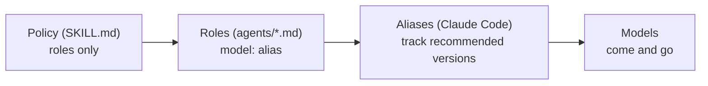

# pilotfish — Design Rationale

## Purpose

This document explains *why* pilotfish is shaped the way it is: a Claude Code plugin that delivers role-based policy, model aliases in role frontmatter, effort tiers, a verification gate, and a guard hook that enforces what policy can only ask for. The empirical grounding (official docs, measured community numbers, subscription economics) lives in the [research report](./research.zh-TW.md); this is the argument from those facts to this design.

## Delivery: a plugin, not a config merge

pilotfish ships as a Claude Code plugin — `/plugin marketplace add Nanako0129/pilotfish`, then `/plugin install pilotfish@pilotfish`, invoked with `/pilotfish`. It writes nothing into your `~/.claude/` config or into your projects: installing adds a self-contained namespaced bundle, uninstalling removes every trace. That packaging choice drives one detail that matters later — plugin agents are namespaced (`pilotfish:scout`, `pilotfish:executor`), which is precisely *why* the old "shadow the built-in Explore with a same-name agent" trick cannot work here, and why enforcement moved to a guard hook (see [The guard](#the-guard), below).

## The three layers

The core observation is that "who executes what", "how delegation behaves", and "which rules must be structurally enforced" change at different rates and should therefore live in different places:

| Layer | File | Changes when | Mechanism |
|---|---|---|---|
| Roles | `agents/*.md` | A model tier is re-pointed | One `model:` line of frontmatter per role |
| Policy | `skills/pilotfish/SKILL.md` | Your working style changes | Prose rules written against role names; loads on `/pilotfish` |
| Guard | `hooks/` + `scripts/guard.py` | Rarely | A `PreToolUse` hook that removes capabilities policy can only request |

The policy is a **skill**, not a `CLAUDE.md` block, so it loads on demand when you type `/pilotfish` rather than sitting in every session's context. It never names a model — it delegates to role names, and the role frontmatter owns the model bindings. The main-session model stays a user/`settings` concern that pilotfish deliberately does not touch: settings decide *who* orchestrates, the skill decides *how* it delegates, and the guard makes a few of those "how" rules non-optional.

## Role-based policy, model-free prose

The single most important rule in pilotfish: **the policy text never names a model.** It says "delegate mechanical work to `mech-executor`", not "delegate to Sonnet". Model bindings exist in exactly one place — the frontmatter of each agent file.

This is what makes the fallback story degenerate into no-ops:

The June 2026 export-control suspension was a live test of this: accounts on aliases degraded gracefully — a notice banner, new sessions continuing on Opus — while users who had pinned the full `claude-fable-5` model ID got hard 404 errors. That is the resilience story working: every role's alias re-resolves and keeps its binding, and the policy text is already model-agnostic. The July 2026 subscription-to-credits boundary is expected to behave the same way per the documented resolution rule, though Anthropic has not published the exact boundary UX — worst case is one manual `/model` switch or enabling usage credits. The same holds for the next deprecation cycle (Opus 4.8 → 4.9, Sonnet 5 → next): aliases track the recommended version by design.

Three distinct failure modes get three distinct mechanisms — they are often conflated but shouldn't be:

| Failure | Mechanism | Layer |
|---|---|---|
| Lost *access* to the frontier model | `best` alias | settings |
| Model *overloaded / erroring* | `fallbackModel` chain | settings |
| Model *deprecated* | aliases in role frontmatter | agents |

Only the third row is pilotfish's own — the plugin ships the role aliases and nothing else. The first two are user-owned `settings.json` mechanisms pilotfish recommends but does not install (a plugin writes nothing to your config); they protect the main session, which pilotfish leaves to you.

## Why these five roles

The role set is the smallest one that covers the delegation patterns that actually recur, mapped to the cheapest tier that reliably handles each:

| Role | Tier argument |
|---|---|
| `scout` | Reconnaissance is the highest-volume, lowest-judgment token sink in a coding session (telemetry showed ~36% of calls were exploration even before deliberate routing) — so it is tempting to route to the cheapest tier available. pilotfish deliberately does not. Scout output is *unverified input* to everything downstream: a wrong `file:line` becomes an executor editing the wrong thing, and the verifier gate covers executor work, not recon. Sonnet at low effort is the floor where that stops happening. It also costs less than it appears — on subscriptions Haiku draws on the *scarce* shared all-models bucket, while Sonnet can draw on the dedicated Sonnet-only bucket on top of it. `scout` carries a positive `tools: Read, Glob, Grep` allowlist, so "read-only" is enforced, not just prompted. It is also where recon *must* land: the guard blocks the built-in `Explore` (see below) and points callers here. |
| `mech-executor` | Fully-specified work has its judgment already done — by the orchestrator, in the spec. Sonnet executes specs faithfully at `effort: low`, which is the entire point of keeping this role separate from `executor` (see below). |
| `executor` | Real implementation needs local design judgment — but not frontier reasoning. Sonnet at high effort is the configuration Anthropic itself benchmarked as an orchestrator's worker: 96% of all-frontier performance at 46% of the cost. Routing this to Opus was pilotfish's earlier choice and it was over-insurance: the quality is bought back by the `verifier`, more cheaply and more reliably than by upgrading the executor. |
| `verifier` | Official guidance: independent fresh-context verifiers outperform self-critique. This is the role that makes cheap executors safe, so it is the one place the frontier-adjacent tier is worth paying for — and it is cheaper than it looks, because an executor's cost scales with the *search space* it explores while a verifier's scales only with the *diff* it is handed. It is read-and-run only — a verifier that fixes things stops being independent. |
| `security-executor` | Two reasons: security work deserves consistently high effort, and the frontier model's safety classifiers can refuse benign defensive-security work mid-task. Pre-routing security to Opus makes the refusal path unreachable instead of handled. |

**Why three Sonnet roles instead of one.** `scout`, `mech-executor`, and `executor` all run on Sonnet and differ only in effort and tool access — which looks like role proliferation until you check the `Agent` tool's parameters. It accepts `model`, but there is **no `effort` parameter**: effort can be set *only* in agent frontmatter. So one role definition means exactly one effort level for everything it is ever asked to do, and collapsing them would run a 30-file mechanical rename at `effort: high` — paying frontier-shaped thinking latency for work with no decisions in it. Three files is the only mechanism the harness offers for three effort lanes.

## The guard

A policy is a request; a subagent can read "don't do X" and do X anyway. Removing the capability is a fact. Three rules that used to be prose in a policy block are now enforced by a `PreToolUse` hook (`scripts/guard.py`), because prose kept failing. Enforcement-by-hook beats enforcement-by-instruction for the same reason a locked door beats a "please don't enter" sign: the model never gets to weigh the rule against the task in front of it.

| | Main session | Subagent |
|---|---|---|
| `run_in_background` on `Bash` | allowed | **denied** |
| `nohup` / `setsid` / `disown` / trailing `&` | allowed | **denied** |
| built-in `Explore` agent | **denied** → use `scout` | — |

Two things the guard buys:

- **Backgrounding stays with the orchestrator.** When a subagent's foreground command exceeds its `timeout`, Claude Code promotes it to a background task — but a promoted process from a foreground-spawned agent is `SIGTERM`ed seconds after the agent returns, destroying the work and truncating its output. `nohup`/`setsid` dodge that `SIGTERM` by escaping the process group, but they also escape task tracking entirely, so the result is an orphan nobody collects. So subagents don't detach at all; long-running work is handed back to the main session, the only context whose background tasks are both tracked and reliably notified.
- **Recon can't leak onto the frontier model.** Since Claude Code v2.1.198 the built-in `Explore` inherits the main-session model, so every search it runs from a Fable/Opus session bills at frontier rates. The earlier design tried to neutralize this by shadowing `Explore` with a same-name user-level agent pinned to Haiku — **that does not work for a plugin**, because plugin agents are namespaced (`pilotfish:Explore` is a different agent from the built-in `Explore` and cannot shadow it). So the guard blocks the built-in outright and instructs the caller to re-issue the call as `scout`, which is the same read-only recon role pinned to Sonnet at low effort.

**Honest about the limits.** The `run_in_background` denial is airtight: it is a structural block on a typed boolean parameter — either the flag is set or it isn't, and the check can't be evaded by phrasing. The shell-detach denial is *not* airtight: `nohup`/`setsid`/`disown`/trailing-`&` are matched by regex over the command string, which reliably catches the accidental, idiomatic case (a subagent reaching for `nohup … &` out of habit) but cannot defeat a determined evasion — quoting tricks, an indirection through a wrapper script, or a detaching syscall never spelled `nohup` all slip past string matching. This is best-effort defense-in-depth for the common failure, not a security boundary. The guard also fails open: a malformed hook payload never breaks your session.

## Quality: verification over executor pedigree

The intuitive objection to cheap executors is quality. pilotfish's answer is structural, not hopeful:

1. The orchestrator writes complete one-shot specs (goal, constraints, done-criteria, the *why*) — most cheap-model failures are actually spec failures.
2. Escalation is bounded: two failed attempts on a tier, then escalate or take over. No infinite cheap retries that burn more than they save.
3. Non-trivial work passes through `verifier` — an adversarial, fresh-context pass that tries to *refute* the claimed outcome before the orchestrator reports it done.

A verifier isn't free — it runs on Opus and re-reads context in a fresh session. It's cheaper than generation only because it reads-and-runs rather than writes-and-iterates, and because the gate is scoped to *non-trivial* work (small changes skip it; the policy says so). What it buys is a change of question: from "is the executor smart enough?" to "did the output survive an independent refutation attempt?" — a much better question. Two known limits, held honestly: same-tier verification catches context-rot and unchecked claims, not capability-ceiling errors (Opus won't know what Opus can't know); and the gate covers executor output, not scout reconnaissance — which is why the policy separately tells the orchestrator to sanity-check load-bearing scouted facts. For security-sensitive diffs, the verifier's own prompt escalates it to a maximum-thoroughness pass.

## Effort tiers

Effort is the second big quota lever after model choice, and the Fable-5 generation shifted the calculus: low effort on current models routinely matches previous-generation `xhigh`. pilotfish therefore pairs every role with an effort:

| Role class | Effort | Why |
|---|---|---|
| Recon (`scout`) | `low` | High volume, near-zero judgment |
| Mechanical (`mech-executor`) | `low` | Judgment lives in the spec |
| Judgment (`executor`, `verifier`) | `medium` | Balance point |
| Security (`security-executor`) | `high` | Correctness over cost |
| Main session | `high` (user setting) | Official Fable 5 guidance: `high` for most work, `xhigh` for the longest horizons only |

## Deliberately left out

| Not included | Why |
|---|---|
| Per-project configuration | The six projects audited before building this had zero model policy in their `CLAUDE.md` files — correctly. The plugin is a single source of truth; project files stay pure technical notes. |
| Heavy orchestration hooks (spawn guards that block under-specified delegations, stop guards à la fable5-orchestrator) | pilotfish ships one narrow guard (backgrounding/detach + the built-in `Explore`; see [The guard](#the-guard)) because those rules can't be enforced any other way. The broader orchestration-discipline hooks stay out: they are heavy, and everything else is better handled by policy plus the verifier gate. If discipline slips, they are the documented next step — see the research report. |
| `CLAUDE_CODE_SUBAGENT_MODEL` | It overrides every per-agent frontmatter globally, which is precisely the opposite of tiered routing. pilotfish never sets it; if you have it set in your environment, unset it or the role model bindings are ignored. |
| Pinned model IDs | Pinning trades resilience for reproducibility; for a personal global config, resilience wins. Organizations that need pinning have `ANTHROPIC_DEFAULT_*_MODEL`. |
| An `opusplan` default | It's a great quota-saver but changes interactive feel (model switches mid-conversation). Offered as an opt-in in the FAQ instead. |

## Prompting style inside the agents

The agent system prompts follow the Fable-5-generation guidance from the research: goals and constraints instead of step-by-step scaffolding, an explicit statement of what *not* to do (no scope creep, verifier never fixes), evidence-audited progress claims, and "a precise *blocked because X* is a successful outcome" to prevent guessing. When editing the agent files in `agents/`, keep that register — prescriptive checklists measurably degrade current-generation output.
